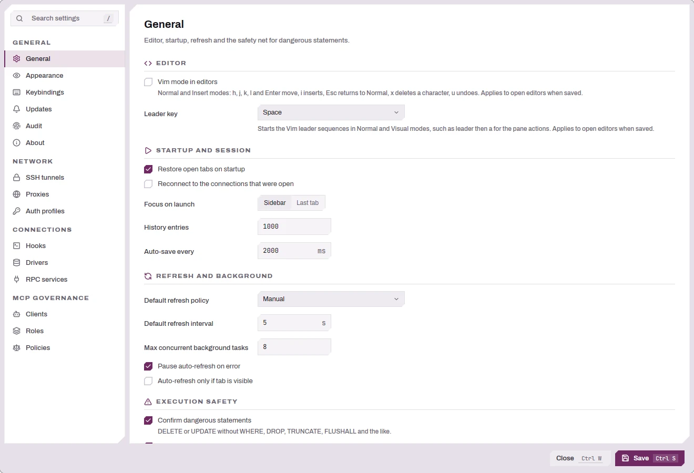

# Settings & Connection Hooks

A reference for every Settings section and for connection hooks — the commands,
scripts, or Lua snippets DBFlux runs around a connection's lifecycle.

Open Settings from the command palette (**Open settings**) or the sidebar. The
window is organized into sections down the left side.

| Section | Covers |
|---------|--------|
| [General](#general) | App-wide behavior: editor, startup, refresh, query safety. |
| [Appearance](#appearance) | Theme, density, language, fonts and the editor's syntax colors. |
| [Audit](#audit) | What the audit log captures and how long it's kept. |
| [Keybindings](#keybindings) | Browse and change the keymap. |
| [Auth Profiles](#auth-profiles-proxies-ssh-tunnels) | AWS SSO / shared-credentials profiles. |
| [Proxies](#auth-profiles-proxies-ssh-tunnels) | SOCKS5 / HTTP proxy profiles. |
| [SSH Tunnels](#auth-profiles-proxies-ssh-tunnels) | Reusable SSH tunnel profiles. |
| [Services](#services-rpc) | External RPC drivers and auth providers. |
| [Hooks](#connection-hooks) | Reusable connection-hook definitions. |
| [Drivers](#drivers) | Per-driver overrides and settings. |
| About | Version and build information. |

MCP-related sections (Clients, Roles, Policies) appear only when the binary is
built with the `mcp` feature, which is the default; see [AI + MCP
Integration](MCP_AI_INTEGRATION.md).

---

## General

<picture>
  <source media="(prefers-color-scheme: dark)" srcset="images/settings/general-dark.webp">
  
</picture>

### Editor

| Setting | Default | What it does |
|---------|---------|--------------|
| **Vim mode in editors** | Off | Modal editing in every multi-line editor (code editor, object editor, JSON dialogs, value panel, collection JSON view and pipeline; motions only in read-only viewers): Normal and Insert modes with `h`, `j`, `k`, `l`, `i`, `Escape`, `x`, and `u`. Applies to open editors when you save. See [Vim mode](KEYBOARD.md#vim-mode-opt-in) in the keyboard reference. |
| **Leader key** | Space | The key that starts Vim's leader sequences in Normal and Visual modes, such as the leader then `a` for the pane actions: Space, comma or backslash. Applies to open editors when you save, and leader bindings you changed in **Keybindings** follow it. |

### Startup & session

| Setting | Default | What it does |
|---------|---------|--------------|
| **Restore session on startup** | On | Reopen the tabs you had open last time. |
| **Reopen last connections** | Off | Reconnect to the connections that were active. |
| **Default focus** | Sidebar | Where focus lands on launch (Sidebar or the last tab). |
| **Max history entries** | 1000 | Query-history cap (minimum 10). |
| **Auto-save interval (ms)** | 2000 | How often open editors auto-save (minimum 500). A script backed by a file is written to that file; unsaved untitled content is kept in the sessions folder. |

### Refresh & background

| Setting | Default | What it does |
|---------|---------|--------------|
| **Default refresh policy** | Manual | Manual or Interval auto-refresh for data views. |
| **Default refresh interval (seconds)** | 5 | Interval used when the policy is Interval (minimum 1). |
| **Max concurrent background tasks** | 8 | Cap on simultaneous background work (minimum 1). |
| **Pause auto-refresh on error** | On | Stop auto-refreshing a view after it errors. |
| **Auto-refresh only if tab is visible** | Off | Skip refreshing tabs you're not looking at. |

### Notifications

| Setting | Options | Default |
|---------|---------|---------|
| **Toast timeout** | 4 seconds, 8 seconds, 15 seconds, Keep until dismissed | 8 seconds |

**Toast timeout** sets how long a toast stays before it closes on its own.
Success and Info toasts close after it, and Warning toasts after twice it. An
Error toast, and a toast with an action button or a progress bar, stays until
you dismiss it. **Keep until dismissed** turns automatic closing off for every
toast. Pointing at a toast holds its timer, which resumes when the pointer
leaves.

Toasts stack in the top-right corner of the document area. At most four are
shown at once; older ones fold into an *N more* entry that expands them or
dismisses them together.

### Execution safety (dangerous-query confirmation)

These three settings govern how DBFlux treats risky queries across **all**
drivers and query languages. There is no per-database toggle — the same rules
apply to SQL `DELETE`/`DROP`/`TRUNCATE`, MongoDB `deleteMany`/`drop`, Redis
`FLUSHALL`/`FLUSHDB`, and so on.

| Setting | What it does |
|---------|--------------|
| **Confirm dangerous queries** | On by default; show a confirmation before running a dangerous query. Turn off to allow them without prompting. |
| **Require WHERE for DELETE/UPDATE** | On by default; treat a `DELETE`/`UPDATE` with no `WHERE` as dangerous. |
| **Always require preview (ignore suppressions)** | Off by default; force the confirm/preview modal even for queries you previously chose to stop confirming. |

**Editor row limit** (default 10,000) caps how many rows a query run from the
query editor returns. It is a separate execution-safety setting, not one of the
three dangerous-query controls above. It accepts any whole number from 1 upward
and cannot be set to zero or turned off: saving any other value shows an error
and keeps the previous limit. DBFlux sends the limit to the driver with every
editor query instead of adding a `LIMIT` to the query text. When a result left
rows out, its footer reads "First 10,000 rows loaded" instead of the row count.
For a single statement that only reads, the footer then offers **Count rows**,
which runs the statement inside `SELECT COUNT(*)` without fetching its rows and
shows "10,000/52,310 rows loaded" (SQL connections only), and **Load all
rows**, which runs the statement again without the limit in the same result
tab. Both are also in the table menu (`m`). Scrolling to the last loaded row,
or moving the cursor onto it, fetches the next rows of that statement, as many
as the limit, and appends them; this repeats until the statement has no more
rows. While a column is sorted in the grid, the next rows are not fetched. In a
script with several statements the limit is one budget shared by all of its
result sets, and every statement still runs.

Drivers that cannot enforce a row limit refuse the query before running it
rather than ignore the cap. Editor queries therefore fail with an "Operation
not supported" error on MongoDB, Redis, Turso, InfluxDB, ClickHouse, Redshift,
CloudWatch, external RPC drivers, and DynamoDB writes (PartiQL
`INSERT`/`UPDATE`/`DELETE` and put, update, and delete commands). Changing the
limit does not change this. The limit adds no timeout and does not apply to
Lua, Python, or Bash scripts, connection hooks, or metrics. The
[console](CONSOLE.md) sends the same limit to drivers that can enforce it and
runs its commands without one on the others.

### Storage (Nightly builds only)

| Setting | Default | What it does |
|---------|---------|--------------|
| **Use the stable database** | Off | Make a Nightly build share the stable `dbflux.db` instead of `dbflux-nightly.db`. Applies on next launch. |

See [Data & Privacy](../PRIVACY.md#data-locations) for how the Nightly and
stable databases are separated.

---

## Appearance

| Setting | Options | Default |
|---------|---------|---------|
| **Theme** | Follow system, Dark, Light | Dark |
| **Density** | Default, Compact | Default |
| **Language** | System, then every language with a shipped translation catalog | System |
| **Interface font** | Default (Archivo), or any installed font | Default |
| **Interface font size** | 8 to 32 px, decimals allowed | 13 |
| **Editor font** | Default (JetBrains Mono), or any installed font | Default |
| **Editor font size** | 8 to 32 px, decimals allowed | 13 |
| **Data grid font** | Same as editor, or any installed font | Same as editor |
| **Data grid font size** | 8 to 32 px, decimals allowed | 12.5 |

Font changes apply to every open window as soon as you save; no restart is
needed. The editor font also sets the monospace text in the interface
(metadata, key hints, console), and a custom interface font also replaces the
expanded display face of section labels. What each size controls:

- **Interface font size** scales all interface text, rows, controls and icons.
- **Editor font size** sets the code editor text and line height, and the
  console text.
- **Data grid font size** sets cell text, row and header height, and the
  automatic column widths. Columns you resized by hand keep their width.

The font lists have a search field, since a system can have hundreds of fonts.
A saved font that is no longer installed stays selected, marked
"(not installed)", and DBFlux draws with the default until it is installed
again; the data grid falls back to the editor font.

The language list is derived from DBFlux's shipped translation catalogs: English
appears first, followed by the remaining languages in deterministic order and
shown by their native names. System follows your OS locale and falls back to
English when no shipped locale matches unambiguously. A language change takes
effect after you restart DBFlux, so the control shows a permanent note to that
effect. Partial catalogs fall back to English for untranslated general UI text.
This release only translates the General section; the rest of the UI is being
converted crate by crate and stays in English for now.

### Syntax colors

The colors of the code editor's syntax highlighting can be changed per role:
keywords, strings, numbers and NULL, comments, types, functions, operators and
punctuation, identifiers, schemas, and columns. **Colors for** picks which theme you are editing,
Dark or Light; each theme keeps its own colors, and **Follow system** uses the
colors of the theme it resolves to.

Each role has a color swatch, a field and a **Reset** button. The field shows
the color in use, the default until you change it, so it can be copied. Type a
color as `#RRGGBB` (the `#` is optional); an empty field, or the default color,
keeps the default. **Reset** (or `R` on the row) restores the
default color of that role, and **Restore defaults** (or `Shift+R`) restores
every color of the theme shown. Changes apply to open editors when you save. The
same colors tint the schema tree icons and NULL values in the data grid.

---

## Audit

The Audit section controls the unified audit log. The main user-facing control
is **Log Capture → Minimum Level** (trace / debug / info / warn / error), which
sets how much of DBFlux's internal logging is folded into the audit trail. Saving
takes effect without a restart.

Retention (how long events are kept) drives a periodic background purge when
configured. For the day-to-day audit experience — opening the viewer, filtering,
exporting — see [Audit → Audit viewer](AUDIT.md#audit-viewer). For
the full event schema and redaction behavior see [Audit](AUDIT.md) and
[Data & Privacy](../PRIVACY.md#audit-and-privacy).

---

## Keybindings

This section lists the active keymap grouped by context. Filter it by command,
key or context predicate with the text field, or show one context with the
context filter. A context that inherits from another (the Editor inherits from
Global) also lists the inherited bindings it does not shadow. The full default
keymap is documented in [Keyboard Reference](KEYBOARD.md).

<picture>
  <source media="(prefers-color-scheme: dark)" srcset="images/settings/keybindings-dark.webp">
  
</picture>

**Changing a shortcut.** Press the pencil on a binding, or select it and press
`Enter`, then press the new keys. A shortcut can be one key with its modifiers
or a sequence of up to four, such as `g g` or `Ctrl+K Ctrl+S`: press them one
after the other, and the recording is saved after a one-second pause. `Esc`
cancels. While recording, **Remove shortcut** leaves the binding with no key.
Keys the settings window uses itself, such as `Ctrl+S` or `Tab`, can be recorded
too. A bare `Esc` cannot be recorded because it cancels.

**Contexts.** Every binding applies in a context, written as a predicate in the
same language Zed uses. Press the layers button on a binding, or select it and
press `p`, to edit it; `Enter` saves and `Esc` cancels. A predicate combines
names with `&&`, `||` and `!`, compares a value with `==` or `!=`, and uses
`A > B` for "B inside A", with parentheses for grouping:

| Predicate | Applies |
|-----------|---------|
| `Editor && !Modal` | in a code editor, not while a dialog is open |
| `Editor && vim_mode == normal` | in a code editor in Vim Normal mode |
| `Editor && language == mongo` | in a code editor for a MongoDB query |
| `Results \|\| Audit` | in a result grid or the audit viewer |
| `SidebarPanel && tab == scripts` | in the Scripts tab of the sidebar |
| `CodeEditor > Input` | in the code editor's text buffer |

The names are the context names shown by the context filter (`Global`,
`Sidebar`, `Editor`, `Results`, `DataTable`, `Input`, `Modal`, …), the window
names `Workspace`, `SettingsWindow` and `ConnectionManagerWindow`, and the
panel names `ActivityRail`, `CommandSearch`, `SidebarPanel`, `CodeEditor`,
`ResultPanel`, `RowInspector`, `KeyValueConsole`, `NativeConsole`, `DocumentQueryBar`,
`DocumentSchema`, `DocumentAggregate`, `DashboardsPanel` and `SettingsSection`. The values are
`vim_mode` (`normal`, `insert`, `replace`, `visual`, `visual_line`,
`visual_block`, present only with Vim editing on), `language` (`sql`, `mongo`,
`redis`, `lua`, `python`, `bash`, …), `tab`, `section` and `focus`. A predicate
that does not parse is not saved; one that names something DBFlux never sets is
saved with a warning, because it never matches.

**Which binding wins.** A binding of an element that has focus (a text field,
a data table, a dialog, the document tree) wins over a binding of the panel
around it, and a binding you changed wins over a default bound to the same keys
in the same place. With Vim editing on, a binding you made for a Vim mode, such
as `space r` in `Editor && vim_mode == normal`, runs before Vim reads the key;
the default bindings leave Vim's own keys to Vim. A focused button, checkbox or
list row always takes `Enter` and `Space` itself.

**Warnings and conflicts.** If the new keys are already used by another command
in a context that can be active at the same time, nothing is saved yet: a
warning names the other command and its context. **Cancel** keeps everything as
it was. **Replace** gives the keys to the binding you are editing and removes
them from the other one, which keeps no shortcut until you reset it. A binding
that collides with another shows a "conflicts with" badge, and the footer counts
the conflicts. Two badges warn without blocking: "shares a key sequence" when one
binding's keys start another's (DBFlux then waits a second after the shorter one
to see whether the longer one follows), and "takes typed text" when a plain
letter is bound where text is typed, such as a text field or the code editor
outside Vim's Normal and Visual modes.

**Resetting.** An overridden binding shows a reset arrow that restores its
default keys and context (`r` on a selected binding does the same, and `Delete`
removes its shortcut). **Reset to defaults** in the footer drops every override,
as `Shift+R` does from the list. `c` opens the context filter.
The footer also shows how many bindings are overridden.

Changes apply at once in every window, without a restart. Only your overrides
are stored, in the `cfg_keybinding_overrides` table of `dbflux.db`, so bindings
you did not change follow the defaults of future releases. An override whose
default binding a later release removes is ignored.

---

## Auth Profiles, Proxies, SSH Tunnels

These three sections manage the reusable profiles you then select per connection
on the Access tab. They're documented in full — fields, AWS SSO flow, no-proxy
rules, SSH auth methods — in
[Connecting to a Database → Advanced Setup](CONNECTIONS.md):

- [Auth Profiles](CONNECTIONS.md#auth-profiles-aws-sso-and-shared-credentials)
- [Proxies](CONNECTIONS.md#proxies)
- [SSH Tunnels](CONNECTIONS.md#ssh-tunnels)

Credentials entered here are stored in your OS keyring, not the database. See
[Data & Privacy → Secrets](../PRIVACY.md#secrets-and-the-os-keyring).

---

## Services (RPC)

External drivers and auth providers run as separate processes that DBFlux talks
to over a local socket. Each service you add here has:

| Field | Notes |
|-------|-------|
| **Socket ID** | Unique identifier, used as the socket filename. ASCII letters, digits, `.`, `_`, `-` only. |
| **Command** | The executable to launch (optional for some setups). |
| **Startup Timeout (ms)** | How long to wait for the process to come up. Default 5000. |
| **Service Type** | **Driver** or **Auth Provider**. |
| **Enable this service** | Whether the service starts. Default on. |
| **Arguments** | Ordered process arguments. |
| **Environment Variables** | `KEY=value` pairs passed to the process. |

Changes here **take effect on the next launch**. Full reference:
[RPC Services Config](RPC_SERVICES_CONFIG.md) and the
[Driver RPC Protocol](DRIVER_RPC_PROTOCOL.md).

---

## Drivers

Pick a driver to see and override its behavior. Two groups are editable:

**Global overrides** — per-driver versions of the General settings. Each is a
tri-state (Inherit / On / Off, or an explicit value); leaving it on *Inherit*
uses the General default shown next to the control:

- Refresh policy and interval
- Confirm dangerous queries
- Require WHERE
- Require preview

**Driver settings** — options defined by the driver itself (rendered generically
from the driver's own schema, so the available fields depend on the driver).

The section also shows, read-only, the driver's **capability matrix**, category,
and query language.

---

## Connection Hooks

Hooks are reusable commands, scripts, or Lua snippets that run around a
connection's lifecycle. You **define** them globally in **Settings → Hooks**, then
**bind** them to phases on individual connections in the Connection Manager's
**Hooks** tab.

### Quick path

1. **Settings → Hooks → add a hook.** Give it a **Hook ID**, pick a **Type**, and
   fill in the command/script.
2. Open a connection in the **Connection Manager → Hooks tab**.
3. Select your hook in one of the four phase dropdowns (Pre-connect, Post-connect,
   Pre-disconnect, Post-disconnect).
4. Connect. Hook output streams into the **Tasks** panel.

### Hook types

| Type | What it runs | What you provide |
|------|--------------|------------------|
| **Command** | An executable | A command and space-separated arguments. |
| **Script** | A Bash or Python file | A language, a file path, and an optional interpreter override (blank = `bash` / `python3`, platform-adjusted). |
| **Lua** | An in-process Lua script | A file path and a set of capabilities (see below). Lua runs inside DBFlux — no external interpreter. |

Scripts are edited in DBFlux's editor and stored under a `hooks/` folder by
default.

#### Lua capabilities

A Lua hook only gets the abilities you enable:

| Capability | Grants |
|------------|--------|
| **Logging** | On by default; write to the hook's output. |
| **Environment read** | On by default; read environment variables. |
| **Connection metadata** | On by default; read the connecting profile's metadata. |
| **Controlled process run** | Off by default; call `dbflux.process.run(...)` to launch external processes. |

> Enabling **Controlled process run** lets the hook execute arbitrary external
> commands. DBFlux shows a security warning when it's on, both in the hook
> definition and on the per-connection binding. Enable it only for hooks you
> trust.

The embedded Lua runtime (available APIs, sandboxing) is documented in
[Lua Scripting](LUA.md).

### Hook options

| Option | Notes |
|--------|-------|
| **Enabled** | Disabled hooks are skipped. |
| **Working Directory** | Process/script cwd (not used by Lua). |
| **Environment** | Extra `KEY=value` pairs. |
| **Inherit parent environment** | On by default; pass DBFlux's env to the hook. |
| **Env Denylist** | Variable names to strip from the inherited env. |
| **Timeout (ms)** | Blank = no timeout. On timeout the process group is killed. |
| **Execution mode** | **Blocking** (default) waits for the hook; **Detached** runs in the background and does not block connect/disconnect. |
| **Ready signal** (Detached) | Text DBFlux waits for in the hook's output before continuing. |
| **On Failure** | The failure policy — see below. |

DBFlux always injects context env vars into process hooks: `DBFLUX_PROFILE_ID`,
`DBFLUX_PROFILE_NAME`, `DBFLUX_DB_KIND`, and, when known, `DBFLUX_HOST`,
`DBFLUX_PORT`, `DBFLUX_DATABASE`.

> **Secrets never leak into hooks by accident.** On top of your Env Denylist,
> DBFlux always strips inherited variables whose name contains `SECRET`, `TOKEN`,
> `PASSWORD`, or `_KEY`, and any `AWS_*` variable.

### Failure policies

What happens when a hook fails (non-zero exit, timeout, or error):

| Policy | Effect |
|--------|--------|
| **Disconnect** (default) | Abort the phase — the connect or disconnect flow stops. |
| **Warn** | Continue, but surface a warning. |
| **Ignore** | Continue; the failure is only logged. |

### Phases

| Phase | Runs |
|-------|------|
| **Pre-connect** | Before the connection opens. |
| **Post-connect** | After a successful connect. |
| **Pre-disconnect** | Before disconnecting. |
| **Post-disconnect** | After disconnecting. |

A connection's Hooks tab has one dropdown per phase (plus an "Extra" input for
binding additional hook IDs). The dropdowns list the reusable hooks you defined
in Settings → Hooks. Each hook runs as its own background task with live
stdout/stderr in the Tasks panel; output is capped at 4 MiB per hook.

---

## Related

- [Getting Started](GETTING_STARTED.md) — the core workflow.
- [Keyboard Reference](KEYBOARD.md) — the full default keymap.
- [Connecting → Advanced Setup](CONNECTIONS.md) — SSH, proxy, auth, value sources.
- [Data & Privacy](../PRIVACY.md#your-data-on-this-machine) — where settings and secrets are stored.
- [Lua Scripting](LUA.md) — the embedded Lua runtime for hooks.
