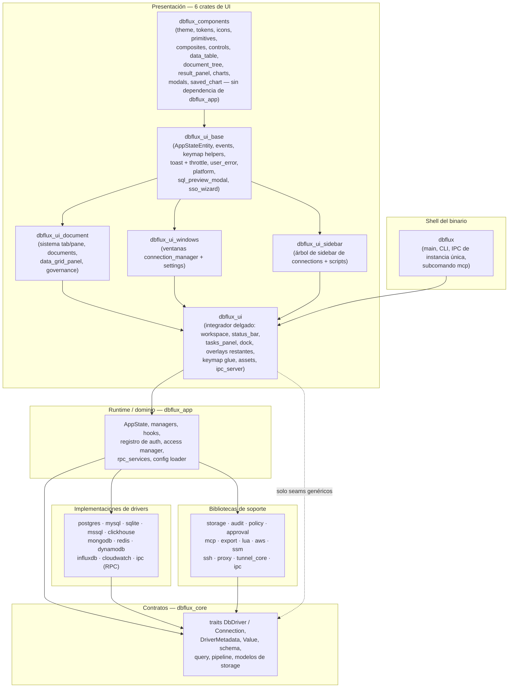
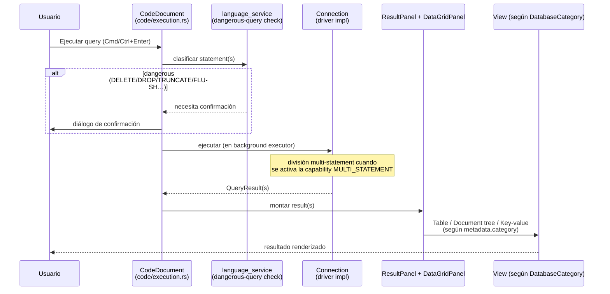
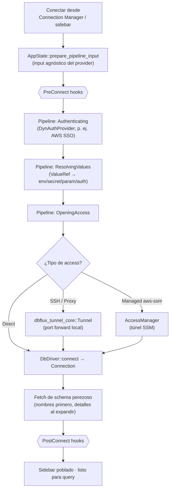

# Arquitectura

Para el modelo conceptual y los límites de contratos, empieza por [Key
Concepts](docs/CONCEPTS.md). Este documento sigue siendo canónico para los
límites de crates y los archivos clave.

## Descripción general

- DBFlux es un cliente de bases de datos centrado en el teclado, construido con
  Rust y GPUI, enfocado en workflows rápidos y una UI de escritorio limpia
  (README.md).
- El repositorio es un workspace de Rust con un crate de aplicación UI más tipos
  core compartidos, implementaciones de drivers y bibliotecas de soporte
  (Cargo.toml, crates/).
- Soporta múltiples paradigmas de bases de datos: relacional (SQL), documentos
  (MongoDB, DynamoDB), key-value (Redis), series temporales (InfluxDB),
  log-stream (CloudWatch Logs), grafos y wide-column stores.
- Este es el documento canónico de nivel superior para la estructura del
  proyecto, la descripción general de la arquitectura, los límites de los
  crates, los archivos clave y el mapa entre crates. El resto de documentos de
  nivel superior deben enlazar aquí en lugar de duplicar ese material.

## Arquitectura de un vistazo

El texto que sigue es exhaustivo pero denso; estos tres diagramas dan primero el
modelo mental. Son conceptuales — los nombres exactos de los símbolos viven en
las secciones siguientes.

### Mapa de crates en capas

Las dependencias apuntan hacia abajo. `dbflux_core` es la capa de contratos sin
dependencias sobre la que se construye el resto de crates; la UI nunca depende
de un crate de driver concreto (ver [Desacoplamiento
Driver/UI](#driver-system)).



### Flujo de queries

Una query viaja desde el editor document hasta una `Connection` del driver y de
vuelta a una vista de resultado elegida por `DatabaseCategory` — la UI nunca
bifurca según un driver id.



### Flujo de conexión

Conectar ejecuta un pipeline pre-connect agnóstico del provider antes de que el
driver abra, con tunneling/managed access opcional y hooks de lifecycle en cada
fase.



## Stack Tecnológico

- Lenguaje: Rust 2024 edition (crates/dbflux/Cargo.toml).
- UI: `gpui`, `gpui-component` (Cargo.toml).
- Bases de datos: `tokio-postgres` (PostgreSQL), `rusqlite` (SQLite), `mysql`
  (MySQL/MariaDB), `mongodb` (MongoDB), `redis` (Redis), `aws-sdk-dynamodb`
  (DynamoDB), y HTTP vía `reqwest` (ClickHouse) (Cargo.toml).
- Auth/integración AWS: `aws-config`, `aws-sdk-sso`, `aws-sdk-ssooidc`,
  `aws-sdk-sts`, `aws-sdk-secretsmanager`, `aws-sdk-ssm` (`dbflux_aws`).
- IPC/RPC: sockets locales `interprocess` + framing de mensajes `bincode`
  (`dbflux_ipc`, `dbflux_driver_ipc`, `dbflux_driver_host`).
- SSH: `ssh2` vía `dbflux_ssh` (crates/dbflux_ssh/src/lib.rs).
- Export: `csv` + `hex` + `base64` + `serde_json` vía `dbflux_export`
  (crates/dbflux_export/src/lib.rs).
- Serialización/config: `serde`, `serde_json`, `dirs` (Cargo.toml).
- Logging: `log`, `env_logger` (crates/dbflux/src/main.rs).

## Estructura de Directorios

```
crates/
  dbflux/                   # Binary shell: main entry point, CLI, single-instance IPC
    src/
      main.rs               # Application entry point, logging, window bootstrap, IPC socket
      cli.rs                # CLI arg parsing, single-instance IPC client
  dbflux_components/        # Domain-free leaf: theme, tokens, icons, primitives, composites,
    src/                    # controls, typography, data_table, document_tree, tree_nav,
      theme.rs              # Theme definitions
      tokens.rs             # Design tokens (spacing, sizing constants)
      icons/                # SVG icon system (AppIcon enum)
        mod.rs
      icon.rs               # Icon rendering helpers
      primitives/           # Low-level building blocks (badge, banner, label, button, etc.)
      controls/             # Input controls (button, checkbox, dropdown, input, select, etc.)
      composites/           # Composed patterns (header, tabs, split_button, etc.)
      components/           # Domain components
        data_table/         # Custom virtualized data table
          mod.rs
          table.rs          # Main table component with phantom scroller
          state.rs          # Table state management
          model.rs          # CellValue and data model
          selection.rs      # Selection handling
          events.rs         # Event handling
          clipboard.rs      # Copy/paste support
          theme.rs          # Table styling
        document_tree/      # Hierarchical document/JSON viewer
          mod.rs
          state.rs          # Tree state with cursor, expansion, search
          tree.rs           # Tree rendering with keyboard navigation
          node.rs           # Node types (document, field, array item)
          events.rs         # Document tree events (selection, context menu)
        tree_nav/           # Reusable tree navigation component
          mod.rs
          gutter.rs
        filter_bar.rs       # Generic filter bar component
        form_navigation.rs  # FormNavigation / FormEditState traits
        form_renderer.rs    # Generic form field rendering
        json_editor_view.rs # Inline JSON editor component
        multi_select.rs     # Multi-select dropdown component
        value_source_selector.rs # Value source dropdown (Env/Secret/Parameter/Auth)
      modals/               # El `Modal` compartido y los modales construidos sobre él (cell_editor, document_preview, etc.)
      result_panel/         # ResultPanel + ViewHandle universal chrome host
      chart/                # Chart engine (detect, spec, decimate, axis, legend, engine)
      saved_chart.rs        # SavedChart + SavedChartStore type alias
      common/               # Shared helpers (time_range picker, etc.)
      actions.rs            # Shared action definitions
      typography.rs
  dbflux_ui_base/           # AppStateEntity + events, keymap helpers, platform utilities
    src/
      app_state_entity.rs   # AppStateEntity wrapper (Deref + EventEmitter), AppStateGlobal,
                            # UserErrorReported + OpenAuditRequested events, unread_error_count
      keymap/               # Motor del keymap: capas por defecto, overrides, bindings nativos de GPUI
      async_ext.rs          # AsyncUpdateResultExt
      toast.rs              # Toast + ToastHost with severity-aware token-bucket throttle
      user_error/           # Centralized user-facing error reporting (UserFacingError,
                            # ErrorKind, report_error, report_error_async) + throttle
      platform.rs           # X11/Wayland detection, window options
      sql_preview_modal.rs  # SQL/query preview modal (dual-mode: SQL and generic)
      sso_wizard.rs         # SSO account/role discovery wizard [cfg aws]
  dbflux_ui_document/       # Tab/pane system, all document types, data_grid_panel, governance
    src/
      pane.rs               # PaneHandle: closure-erasing shell for typed Entity<T> documents
      tab_manager.rs        # Tab enum, TabManager (Vec<Tab> + MRU order), TabManagerEvent
      tab_bar.rs            # Visual tab bar rendering
      handle.rs             # DocumentEvent enum (unified — replaces per-document event enums)
      dedup.rs              # DocumentKey enum: identity key for tab deduplication
      types.rs              # DocumentId, DocumentKind, DocumentMetaSnapshot, DocumentState
      result_view.rs        # ResultViewMode enum (Table, LiveOutput, etc.)
      task_runner.rs        # Background task tracking for documents
      data_view.rs          # DataViewMode abstraction (Table vs Document)
      data_view_trait.rs    # DataView trait (available_view_modes, focus_handle, active_context)
      chrome.rs             # Shared chrome utilities
      governance/           # McpApprovalsView: MCP approvals document tab (mod.rs, pane.rs)
      history_panel.rs      # Recent/saved queries side panel
      add_member_modal.rs   # Modal for adding Redis set/list/sorted-set members
      new_key_modal.rs      # Modal for creating new Redis keys
      chart_document/       # ChartDocument: saved/interactive chart tab
        mod.rs              # ChartDocument entity
        pane.rs             # ChartDocument::into_pane constructor
        render.rs           # impl Render for ChartDocument
      data_document/        # DataDocument: standalone data browsing tab
        mod.rs              # DataDocument entity (thin shell around DataGridPanel + ResultPanel)
        pane.rs             # DataDocument::into_pane constructor
      data_grid_panel/      # Data grid with table/document view modes
        mod.rs
        context_menu.rs
        filter_bar.rs
        mutation_confirm.rs
        mutation_executor.rs
        mutations.rs
        navigation.rs
        query.rs
        render.rs
        row_inspector.rs
        utils.rs
      code/                 # CodeDocument: query/script editor
        mod.rs
        pane.rs             # CodeDocument::into_pane constructor
        completion.rs       # Language-aware autocompletion
        context_bar.rs      # Execution context dropdowns (connection/database/schema)
        diagnostics.rs      # Live query diagnostics
        execution.rs        # Query and script execution flow (incl. dangerous-query confirmation)
        file_ops.rs         # Auto-save, scratch/shadow file management
        focus.rs            # Internal focus management
        live_output.rs      # Document-owned streamed script output buffer
        render.rs           # Toolbar, editor, and live output rendering
      console/              # NativeConsole: reusable command console docked under a document
        mod.rs              # Entity, execution, audit, history recall, render
        format.rs           # Dangerous-command gate, result formatting, recall list
      console_document/     # ConsoleDocument: a native console in its own tab
        mod.rs
        pane.rs             # ConsoleDocument::into_pane constructor
      key_value/            # Redis/key-value-specific document tab
        mod.rs              # KeyValueDocument entity
        pane.rs             # KeyValueDocument::into_pane constructor
        view.rs             # KeyValueView boundary struct (file-level render helpers)
        commands.rs
        context_menu.rs
        copy_command.rs
        document_view.rs
        mutations.rs
        pagination.rs
        parsing.rs
        render.rs           # impl Render for KeyValueDocument
      audit/                # AuditDocument: unified event/audit viewer tab
        mod.rs              # AuditDocument entity
        pane.rs             # AuditDocument::into_pane constructor
        view.rs             # LogStreamView boundary struct
        render.rs           # Extracted render code (~1300 LOC)
        commands.rs         # Extracted command dispatch (~560 LOC)
        filters.rs
        saved_filter.rs
        source_adapter.rs
      chart/                # ChartShell host for metric/instance charts (distinct from chart_document/)
        mod.rs
        shell.rs            # ChartShell host entity
        host.rs
        metric_picker.rs
        metric_picker_render.rs
        toolbar.rs
      instance_inspector/   # InstanceInspectorDocument (backs DocumentKey::InstanceInspector)
        mod.rs
        pane.rs             # into_pane constructor
  dbflux_ui_sidebar/        # Connections + scripts sidebar tree with folders, drag-drop
    src/
      lib.rs                # SidebarView entity (re-exported by dbflux_ui)
      code_generation.rs
      context_menu.rs
      deletion.rs
      drag_drop.rs
      expansion.rs
      operations.rs
      render.rs
      render_footer.rs
      render_overlays.rs
      render_tree.rs
      selection.rs
      table_loading.rs
      tree_builder.rs
  dbflux_ui_windows/        # Settings window + connection manager window
    src/
      ssh_shared.rs         # Shared SSH auth UI components
      settings/             # Settings window sections
        mod.rs
        render.rs           # Top-level settings window rendering
        lifecycle.rs        # Settings window open/close/save logic
        sidebar_nav.rs      # Settings sidebar navigation (TreeNav)
        dirty_state.rs      # Unsaved-changes tracking for settings forms
        form_nav.rs         # FormGridNav<F> generic 2D grid navigation
        form_section.rs     # FormSection trait for keyboard navigation
        section_trait.rs    # SettingsSection trait
        general.rs          # General settings (theme, safety toggles)
        keybindings.rs      # Keybindings settings section
        auth_profiles_section.rs # Dynamic auth profile CRUD by provider form definition
        proxies.rs          # Proxy CRUD form with FormGridNav
        ssh_tunnels.rs      # SSH tunnel CRUD form with FormGridNav
        hooks.rs            # Hook definitions CRUD
        drivers.rs          # Per-driver settings overrides
        rpc_services.rs     # RPC services settings UI (Driver/Auth Provider descriptors)
        audit_section.rs    # Audit settings section
        about_section.rs    # About section
        mcp_section.rs      # MCP settings (trusted clients, roles, policies, audit; feature-gated)
      connection_manager/   # Connection manager window
        mod.rs
        access_tab.rs       # Unified access mode editor (Direct/SSH/Proxy/SSM)
        form.rs             # Connection form state and field management
        navigation.rs       # Keyboard navigation within connection manager
        render.rs           # Top-level connection manager rendering
        render_driver_select.rs
        render_tabs.rs
        hooks_tab.rs        # Per-profile hook bindings
  dbflux_ui/                # Thin integrator (~13.5k LOC): wires the six UI crates together
    src/                    # Re-exports moved subsystems via pub use shims at old module paths
      lib.rs                # Crate root; re-exports via shim modules
      app.rs                # GPUI app bootstrap
      app_menu.rs           # Barra de menú de macOS (Acerca de, Servicios, Ocultar, Salir)
      ipc_server.rs         # App-control IPC server (Focus, OpenScript)
      assets.rs             # GPUI AssetSource impl for embedded SVG icons
      platform.rs           # Shim: pub use dbflux_ui_base::platform::*
      keymap/               # Keyboard glue (actions, dispatcher)
        mod.rs
        actions.rs
        dispatcher.rs
      ui/
        views/
          workspace/        # Main layout, command dispatch, focus routing
            mod.rs
            actions.rs      # Workspace-level action handlers
            dispatch.rs     # Command dispatch logic
            render.rs       # Workspace rendering
            shell.rs        # Title bar, activity rail, empty workspace
          status_bar.rs     # Status bar rendering
          tasks_panel.rs    # Background tasks panel
        dock/
          sidebar_dock.rs   # Collapsible, resizable sidebar
        overlays/           # Remaining overlays that stay in dbflux_ui
          command_palette.rs       # Fuzzy command palette
          login_modal.rs           # SSO login waiting modal with timeout
          shutdown_overlay.rs      # Graceful shutdown overlay
          # Shims at old overlay paths re-export from dbflux_ui_base / dbflux_components:
          sql_preview_modal.rs     # → dbflux_ui_base::sql_preview_modal
          sso_wizard.rs            # → dbflux_ui_base::sso_wizard
        document.rs         # Shim: pub use dbflux_ui_document::*
        icons/mod.rs        # Shim: re-exports AppIcon + embedded_bytes (SVG resources live here)
        theme.rs            # Shim: pub use dbflux_components::theme::*
        tokens.rs           # Shim: pub use dbflux_components::tokens::*
        components/
          toast.rs          # Shim: → dbflux_ui_base::toast
        windows/mod.rs      # Shim: pub use dbflux_ui_windows::*
        views/sidebar/mod.rs # Shim: pub use dbflux_ui_sidebar::*
  dbflux_app/               # Runtime/domain: AppState (plain struct), managers, hooks, auth
    src/
      app_state.rs          # AppState (plain struct, no GPUI dependency)
      access_manager.rs      # AppAccessManager for direct/managed access
      auth_provider_registry.rs # Runtime auth provider registry
      hook_executor.rs       # Composite hook executor routing
      proxy.rs               # create_proxy_tunnel callback for CreateTunnelFn
      config_loader.rs       # SQLite-backed configuration persistence
      rpc_services/          # RPC service discovery/adaptation seam for runtime bootstrap (external_audit, ...)
      history_manager_sqlite.rs # SQLite-backed query history
      mcp_command.rs         # MCP subcommand integration and arg parsing
      keymap/                # Keyboard system (pure domain types)
        mod.rs               # Re-exports Command/ContextId from dbflux_core::keymap_types
        focus.rs             # FocusTarget enum (pure domain)
  dbflux_core/              # Traits, core types, storage, errors
    src/access/             # AccessKind, AccessManager, and managed-access serialization
      mod.rs
    src/auth/               # AuthProfile + DynAuthProvider contracts
      mod.rs
      types.rs
    src/core/               # Fundamental types and traits
      traits.rs             # DbDriver + Connection traits
      error.rs              # DbError type
      error_formatter.rs    # ErrorFormatter trait for driver-specific error messages
      value.rs              # Generic Value type for cross-database data
      shutdown.rs           # ShutdownCoordinator
      task.rs               # Background task tracking
    src/driver/             # Driver metadata and form definitions
      capabilities.rs       # DatabaseCategory, QueryLanguage, DriverCapabilities, DriverMetadata
      form.rs               # Dynamic form definitions per driver
    src/schema/             # Database schema types
      types.rs              # Schema types (tables, collections, indexes, FKs)
      builder.rs            # Builder helpers for schema construction
      node_id.rs            # SchemaNodeId for tree identification
    src/sql/                # SQL generation and dialects
      dialect.rs            # SqlDialect trait for SQL flavor differences
      generation.rs         # SQL INSERT/UPDATE/DELETE generation
      query_builder.rs      # SqlQueryBuilder for safe query construction
      code_generation.rs    # DDL code generation (indexes, types, FKs)
    src/query/              # Query types and language services
      types.rs              # QueryRequest, QueryResult, Row, ColumnMeta
      generator.rs          # QueryGenerator trait, mutation/read templates, semantic preview helpers
      language_service.rs   # Dangerous query detection (SQL, MongoDB, Redis)
      safety.rs             # Safe read query detection
      table_browser.rs      # Table browsing state and pagination
    src/connection/         # Connection management and profiles
      profile.rs            # Connection/SSH profiles
      profile_manager.rs    # ProfileManager
      manager.rs            # ConnectionManager, schema caching, connect flow
      hook.rs               # Hook definitions, HookRunner, phase orchestration
      tree.rs               # Folder/connection tree model
      tree_manager.rs       # ConnectionTreeManager
      context.rs            # Per-tab execution context (connection/database/schema)
      proxy.rs              # ProxyProfile, ProxyKind, ProxyAuth, no_proxy matching
      proxy_manager.rs      # ProxyManager (type alias for ItemManager<ProxyProfile>)
      ssh_tunnel_manager.rs # SshTunnelManager
      item_manager.rs       # Generic ItemManager<T>, Identifiable, DefaultFilename traits
    src/storage/            # Persistence and state
      session.rs            # Session manifest types and scratch/shadow path helpers
      history.rs            # History persistence
      saved_query.rs        # Saved queries persistence
      recent_files.rs       # Recent files tracking
      secrets.rs            # Keyring secret storage
      secret_manager.rs     # SecretManager with HasSecretRef trait
      ui_state.rs           # UiStateStore for persisted UI state (sidebar collapse)
    src/data/               # Data types and operations
      crud.rs               # CRUD mutation types for all database paradigms
      key_value.rs          # Key-value operation types (Hash, Set, List, ZSet, Stream)
      view.rs               # DataViewMode (Table/Document) abstraction
    src/config/             # Application configuration
      app.rs                # Legacy config.json import (deprecated)
      refresh_policy.rs     # Schema refresh policy
      scripts_directory.rs  # Scripts folder tree (file/folder CRUD)
    src/pipeline/           # Pre-connect pipeline (auth/value/access stages)
      mod.rs
      resolve.rs
    src/values/             # ValueRef resolution + provider registry + cache
      resolver.rs
    src/facade/             # Session facade
      session.rs            # Session facade for connection management
  dbflux_ipc/               # Versioned IPC contracts and framing
    src/auth.rs             # IPC auth token generation and file storage
    src/envelope.rs         # ProtocolVersion + app/driver protocol constants
    src/protocol.rs         # Single-instance app-control messages
    src/driver_protocol.rs  # Driver RPC request/response schema (DTOs + errors)
    src/framing.rs          # Length-prefixed bincode transport framing
    src/socket.rs           # Cross-platform socket naming helpers
  dbflux_driver_ipc/        # DbDriver adapter for external RPC services
    src/driver.rs           # IpcDriver + managed host lifecycle
    src/transport.rs        # RPC client transport and handshake
    src/connection.rs       # Connection proxy over driver RPC
  dbflux_driver_host/       # Host process that serves drivers over RPC
    src/main.rs             # Driver RPC server entry point
    src/session.rs          # Session manager and method dispatch
  dbflux_driver_postgres/   # PostgreSQL driver implementation
  dbflux_driver_sqlite/     # SQLite driver implementation
  dbflux_driver_mysql/      # MySQL/MariaDB driver implementation
  dbflux_driver_mssql/      # Microsoft SQL Server driver implementation
  dbflux_driver_mongodb/    # MongoDB driver implementation
    src/driver.rs           # Connection, schema discovery, CRUD operations
    src/query_parser.rs     # MongoDB query syntax parser (db.collection.method())
    src/query_generator.rs  # MongoDB shell query generator (insertOne, updateOne, etc.)
  dbflux_driver_redis/      # Redis driver implementation
    src/driver.rs           # Connection, key-value API, schema discovery
    src/command_generator.rs # Redis command generator (SET, HSET, SADD, etc.)
  dbflux_driver_dynamodb/   # DynamoDB driver implementation
    src/driver.rs           # Connection, schema discovery, scan/query/put/update/delete
    src/query_parser.rs     # JSON command envelope parser for DynamoDB operations
    src/query_generator.rs  # Mutation -> DynamoDB command envelope generator
    tests/live_integration.rs # Docker-backed integration tests (DynamoDB Local)
  dbflux_driver_influxdb/   # InfluxDB driver (v1 + v2)
    src/driver.rs           # Connection, bucket/measurement discovery, query execution
    src/query_generator.rs  # InfluxQL (v1) and Flux (v2) query/template generation
  dbflux_driver_clickhouse/ # ClickHouse HTTP(S) relational driver
    src/driver.rs           # Metadata, connection form, and connection construction
    src/connection.rs       # Query execution and system-catalog discovery
    src/types.rs            # ClickHouse type parsing and value decoding
    src/dialect.rs          # SQL generation dialect
  dbflux_driver_turso/      # TursoDB / libSQL remote driver over Hrana HTTP
    src/driver.rs           # Metadata, connection form, URL validation, connect
    src/connection.rs       # Tokio bridge, batch execution, schema discovery, CRUD, error mapping
    src/session.rs          # ExecutionSessionFactory/ExecutionSession over per-stream connections
    src/dialect.rs          # SQLite dialect, value conversion, DDL code generation
  dbflux_driver_duckdb/     # Embedded DuckDB driver with DuckLake catalogs
    src/driver.rs           # Metadata, connection form, shared instance registry, DuckLake attach
    src/connection.rs       # Execution, read-only checks, catalog discovery, CRUD, execution sessions
    src/dialect.rs          # DuckDB dialect and value literals
  dbflux_driver_cloudwatch/ # AWS CloudWatch Logs driver (DatabaseCategory::LogStream)
    src/driver.rs           # Log group/stream discovery, EventStreamTarget, CollectionPresentation::EventStream
  dbflux_driver_s3/         # AWS S3 object-storage driver (DatabaseCategory::ObjectStorage)
    src/driver.rs           # Bucket/object discovery, ObjectStoreConnection impl, presign/copy/versions
  dbflux_aws/               # AWS auth providers + Secrets Manager/SSM value providers
    src/auth.rs             # AWS SSO/shared/static providers and SSO login flow
    src/config.rs           # ~/.aws/config parser/cache and profile write-back helpers
    src/accounts.rs         # AWS SSO account and role discovery
  dbflux_ssm/               # AWS SSM tunnel factory for managed access
  dbflux_lua/               # Embedded Lua runtime for in-process hooks
    src/executor.rs         # Lua HookExecutor implementation
    src/engine.rs           # Lua VM creation and shared runtime state
    src/api/dbflux.rs       # dbflux.log/env/process Lua APIs
    src/api/connection.rs   # Lua connection.* API (exposes HookContext)
    src/api/hook.rs         # Lua hook.* API (phase, failure policy)
  dbflux_tunnel_core/       # Shared RAII tunnel infrastructure
    src/lib.rs              # Tunnel, TunnelConnector, ForwardingConnection<R>
  dbflux_proxy/             # SOCKS5/HTTP CONNECT proxy tunnel
    src/lib.rs              # ProxyTunnelConfig, SOCKS5/HTTP handshake, tunnel loop
  dbflux_ssh/               # SSH tunnel support
  dbflux_byte_source/       # Fuentes de bytes de acceso aleatorio para lectores de archivos (memoria, archivo local)
  dbflux_parquet/           # Lectura del footer y el índice de páginas de Parquet sobre un byte source (sin GPUI)
  dbflux_spreadsheet/       # Lectura de hojas xlsx, xlsm, xls y ods sobre un byte source con calamine, edición en sitio de celdas xlsx y ods, y escritura de valores en un xlsx nuevo (sin GPUI)
  dbflux_export/            # Export (CSV, JSON, Text, Binary)
    src/lib.rs              # Shape-based export API and format dispatch
    src/binary.rs           # Binary/hex/base64 exporter
    src/csv.rs              # CSV exporter
    src/json.rs             # JSON pretty/compact exporter
    src/text.rs             # Text table exporter
  dbflux_mcp/               # MCP runtime and governance
    src/lib.rs              # Exports for runtime, governance service, tool catalog
    src/runtime.rs          # McpRuntime implementing McpGovernanceService
    src/governance_service.rs # McpGovernanceService trait and DTOs
    src/tool_catalog.rs     # Canonical MCP tools and deferred tool definitions
    src/built_ins.rs        # Built-in roles and policies
     src/handlers/           # MCP tool handlers (query, approval, discovery, scripts)
    src/server/             # MCP server infrastructure (router, authorization, bootstrap)
  dbflux_mcp_server/        # Standalone MCP server binary
    src/main.rs             # CLI entrypoint with --client-id and --config-dir
    src/server.rs           # JSON-RPC request loop over stdin/stdout
    src/bootstrap.rs        # Runtime initialization and state
    src/transport.rs        # Line-based stdin/stdout transport
    src/connection_cache.rs # Connection pool for the standalone server
    src/handlers/           # Tool handlers adapted for standalone operation
  dbflux_policy/            # Policy engine and classification
    src/lib.rs              # Exports for engine, classification, trusted clients
    src/classification.rs   # ExecutionClassification enum (Metadata/Read/Write/Destructive/AdminSafe/Admin/AdminDestructive)
    src/engine.rs           # PolicyEngine with PolicyRole and ToolPolicy
    src/trusted_clients.rs  # TrustedClientRegistry for known AI clients
    src/assignments.rs      # ConnectionPolicyAssignment and PolicyBindingScope
  dbflux_approval/           # Approval service for deferred executions
    src/lib.rs              # Exports for ApprovalService and pending store
    src/service.rs          # ApprovalService (approve/reject lifecycle)
    src/store.rs            # PendingExecutionStore trait, InMemoryPendingExecutionStore (tests), ExecutionPlan
  dbflux_audit/             # Audit logging
    src/lib.rs              # AuditService: validate, fingerprint, redact, record
    src/query.rs            # AuditQueryFilter (actor, category, action, outcome, date range)
    src/export.rs           # Audit export to JSON/CSV (basic and extended schemas)
    src/redaction.rs        # Sensitive value redaction for details_json and error_message
    src/purge.rs            # Retention-based event purge (batched deletes)
    src/store/sqlite.rs     # SqliteAuditStore delegating to AuditRepository
  dbflux_storage/            # Unified SQLite storage
    src/bootstrap.rs        # StorageRuntime with single dbflux.db connection
    src/paths.rs            # dbflux_db_path() returns ~/.local/share/dbflux/dbflux.db
    src/migrations/         # Trait-based migration system
      mod.rs                # MigrationRegistry, Migration trait
      *.rs                  # Individual migration files (001_initial.rs, etc.)
    src/repositories/       # All domain repositories
      traits.rs             # Repository trait (all(), find_by_id(), upsert(), delete())
      audit.rs              # AuditRepository with AuditEventDto
      *.rs                  # Other domain repositories
    src/legacy.rs           # JSON-to-SQLite import
  dbflux_schema_viz/        # Schema visualization
    src/lib.rs              # Re-exports: graph, layout, dbml, sql modules, DbmlScope, SqlScope
    src/graph.rs            # SchemaGraph, TableNode, FkEdge
    src/layout.rs           # Layout algorithms: LeftRight, Snowflake, Compact
    src/dbml.rs             # DBML export (3 scopes: FocalTable, Subgraph, FullSchema)
    src/sql.rs              # SQL DDL export: CREATE TABLE + ALTER TABLE ADD CONSTRAINT (same 3 scopes)
  dbflux_test_support/       # Docker containers and fixtures for integration tests
    src/containers.rs       # Docker container lifecycle (Postgres, MySQL, MongoDB, Redis, DynamoDB Local)
    src/fixtures.rs         # Test fixture helpers
    src/fake_driver.rs      # FakeDriver for unit tests
```

## Componentes Principales

### Capa de Aplicación

- Punto de entrada de la app: `crates/dbflux/src/main.rs` inicializa logging,
  theme y la ventana principal de GPUI.
- Estado global de la app: `crates/dbflux_app/src/app_state.rs` (struct plano,
  sin dependencia de GPUI) contiene drivers, profiles, conexiones activas,
  history, task manager y acceso al secret store.
- CLI e instancia única: `crates/dbflux/src/cli.rs` parsea argumentos;
  `crates/dbflux_ui/src/ipc_server.rs` ejecuta el servidor IPC de control de la
  app para los comandos `Focus` y `OpenScript`.
- Assets: `crates/dbflux_ui/src/assets.rs` implementa `AssetSource` de GPUI para
  servir íconos SVG embebidos.
- Shell de UI del workspace: `crates/dbflux_ui/src/ui/views/workspace/` conecta
  panes (sidebar/dock, área de documents, dock inferior), command palette y el
  enrutado de foco. Dividido entre `mod.rs`, `actions.rs`, `dispatch.rs` y
  `render.rs`. Este módulo permanece en `dbflux_ui`.

### Reporte de errores orientado al usuario

Los fallos disparados por el usuario se enrutan a través de un único seam en
`crates/dbflux_ui_base/src/user_error/mod.rs`, de modo que cada error accionable
produce un toast, una fila de audit y un incremento del badge de la status bar —
todos indexados por el mismo correlation id UUID v7.

- **Puntos de entrada**: `report_error(UserFacingError, &mut App)` (foreground)
  y `report_error_async(UserFacingError, &AsyncApp)` (background / `cx.spawn` /
  `background_executor`). La variante sync NO debe llamarse desde un contexto
  background — requiere `&mut App`.
- **Taxonomía**: `ErrorKind { Storage, Network, Auth, Hook, Driver, User, Config
  }` determina el estilo del badge/toast y el discriminador `action` del audit.
  La severidad reutiliza `dbflux_core::observability::EventSeverity`;
  `report_error` no agrega un enum paralelo.
- **Alimentación desde el driver**: `UserFacingError::from_formatted(kind,
  FormattedError)` consume la salida existente del `ErrorFormatter` del driver.
  El código de la UI nunca bifurca según el driver id.
- **Puente con audit**: el seam emite `tracing::error!(target =
  "dbflux_ui::user_error", correlation_id = %id, kind, action = "user_error",
  outcome = "failure", ...)`. `AuditFieldVisitor`
  (`crates/dbflux_core/src/observability/tracing_bridge/layer.rs`) enruta tanto
  `record_str` como `record_debug` a través de `record_string_by_name` para que
  el slot tipado `EventRecord.correlation_id` se rellene sin importar si el
  campo se registra con el sigilo `%` (Display) o `?` (Debug).
- **Throttle de toasts**: `ToastHost` mantiene un token bucket por severidad
  (capacidad 5, refill de 1 token / 2 s) para Info y Warn, de forma que las
  tormentas de pérdida de conexión no saturen la pantalla. Error y Fatal evitan
  el throttle. El reloj del bucket es inyectable para tests deterministas.
- **Badge + navegación**: `AppStateEntity::note_user_error` incrementa
  `unread_error_count` y emite `UserErrorReported`. El badge de la status bar se
  suscribe y, al hacer click, llama a `AppStateEntity::request_open_audit(None,
  cx)`, que emite `OpenAuditRequested`. La acción "View in Audit" del toast
  emite el mismo evento con `Some(correlation_id)`. El workspace se suscribe una
  vez a `OpenAuditRequested` y dirige `AuditDocument` mediante
  `set_correlation_filter` o `new_with_correlation_id`.
- **Convención**: solo el primer catch site reporta. Los propagadores por encima
  NO deben volver a reportar — no hay deduplicación en runtime, los
  double-toasts son una cuestión de code review (ver AGENTS.md § Error
  Handling).

### Sistema de Documents

`crates/dbflux_ui_document/src/` implementa una arquitectura de documents basada
en tabs con cinco capas:

**Capas (de la más externa a la más interna)**

1. **`Tab`** (`tab_manager.rs`) — enum `#[non_exhaustive]` con una única
   variante `Pane(Box<PaneHandle>)`. Se mantiene como enum por compatibilidad
   futura (por ejemplo, futuras variantes de pane desacoplable). `TabManager`
   mantiene un `Vec<Tab>` más el orden MRU.

2. **`PaneHandle`** (`pane.rs`) — shell que borra closures y reemplaza al
   antiguo enum cerrado `DocumentHandle`. Cada operación
   (render, focus, dispatch_command, meta_snapshot, tab_title, can_close,
   connection_id, active_context, change_summary, refresh_policy,
   set_active_tab, set_refresh_policy, flush_auto_save, matches_dedup_key,
   subscribe, más helpers opcionales como `resolve_close`, `save_for_close`,
   `flush_for_shutdown` e `is_file_backed_empty`) es un closure `Box<dyn Fn>`
   que captura el `Entity<T>` tipado. `PaneHandle` es `!Clone`. Cada tipo de document provee
   `XxxDocument::into_pane(entity, cx) -> PaneHandle` en su propio archivo
   `pane.rs` (todos bajo `crates/dbflux_ui_document/src/`). Agregar un nuevo
   tipo de document no requiere cambios en `workspace/mod.rs`, `tab_manager.rs`,
   `tab_bar.rs` ni `handle.rs`.

3. **`DocumentKey`** (`dedup.rs`) — enum de identidad usado para la
   deduplicación de tabs. Variantes: `Table`, `Collection`, `File`,
   `KeyValueDb`, `Chart`, `Audit`, `EventStream`, `Routine`, `MetricChart`,
   `Dashboard`, `InstanceMetric`, `InstanceInspector`, `InstanceOverview`,
   `ObjectStoreBucketsRoot`, `ObjectBrowser`, `ObjectEditor`. Reemplaza los
   métodos `is_*` del antiguo `DocumentHandle`. Los call sites usan
   `tab_manager.find_by_key(&DocumentKey::Table { ... }, cx)`.

4. **`DocumentEvent`** (`handle.rs`, ~30 LOC) — enum de eventos unificado que
   reemplaza cuatro enums de eventos por-document que fueron eliminados.
   Variantes: `MetaChanged`, `ExecutionStarted`, `ExecutionFinished`,
   `RequestClose`, `RequestFocus`, `RequestSqlPreview`, `OpenInspector`,
   `ChartThisQuery`.

5. **`ResultPanel` + `ViewHandle`**
   (`crates/dbflux_components/src/result_panel/mod.rs`) — host de chrome
   universal. `ResultPanel` posee una fila de chrome y delega el renderizado del
   cuerpo a un `ViewHandle` (7 closures: render, focus, focus_handle,
   toolbar_segments, available_modes, current_mode, set_mode). El sistema de
   slots (`ToolbarSegment { position: SegmentPosition::{Left,Center,Right},
   index: u16, builder }`) permite que las views aporten chrome arbitrario:
   `ResultPanel` combina los segmentos integrados (barra de modos en Left/0
   cuando `available_modes.len() >= 2`) con los segmentos provistos por la view,
   los ordena por `(position, index)` y los renderiza en una fila `flex_wrap`.

**Acciones del panel**

Un document lista las acciones que de otro modo solo ofrece al puntero (los
botones de su toolbar y controles similares) llenando el closure opcional
`PaneHandle::pane_actions` con entradas `PaneAction`: una etiqueta, un icono
opcional, el atajo que el keymap efectivo le da al mismo comando, un indicador
de habilitado y lo que hace al ejecutarse (`PaneActionRun::Command`, que se
ejecuta a través del workspace igual que su key binding, o
`PaneActionRun::Callback` para una acción sin comando). `Command::OpenPaneActions`
va primero al document activo, así que un panel con un menú propio puede
responderlo; si no, el workspace (`views/workspace/pane_actions.rs`) copia las
entradas en un menú dibujado sobre el área de documents. Mientras está abierto,
el workspace reporta `ContextId::ContextMenu`, así que las teclas del menú
contextual lo manejan. El workspace nunca conoce el tipo de document, y un
document se suma desde su propio `pane.rs` sin cambios en `workspace/mod.rs`,
`tab_manager.rs` ni `tab_bar.rs`. `CodeDocument` lista toda su toolbar; la tabla
de datos conserva `m` para su propio menú contextual, que funciona como su menú
de acciones.

**Los tipos de document**

- `DataDocument` (`crates/dbflux_ui_document/src/data_document/`) — shell
  delgado alrededor de `DataGridPanel` + `ResultPanel`. DataGridPanel se monta
  como un `ViewHandle`; una filter bar se inyecta como segmento Center/0.
- `ChartDocument` (`crates/dbflux_ui_document/src/chart_document/`) — entity
  `ChartShell` + `Option<Entity<ResultPanel>>` perezoso. El área del chart, la
  axis bar y los botones de acción se montan como segmentos Left/Center/Right.
  Se renderiza de forma independiente o embebido dentro de un panel de
  `DashboardDocument`.
- `DashboardDocument` (`crates/dbflux_ui_document/src/dashboard/`) — grid
  nombrado de paneles de chart con un `TimeRangePanel` compartido y una refresh
  policy. Cada panel es una entity `ChartDocument` `Loaded` o un placeholder
  `Orphan` para un chart eliminado. La re-ejecución de paneles está acotada por
  `PANEL_REEXEC_CAP`. Ver `docs/DASHBOARDS.md`.
- `CodeDocument` (`crates/dbflux_ui_document/src/code/`) — editor multi-tab.
  Cada tab de resultado envuelve su `DataGridPanel` en su propio `ResultPanel`.
  El chrome externo (editor, context bar, tab strip) se renderiza a sí mismo.
- `KeyValueDocument` (`crates/dbflux_ui_document/src/key_value/`) — se renderiza
  a sí mismo. `KeyValueView` es un boundary struct a nivel de archivo (no una
  entity GPUI separada) que agrupa helpers de render extraídos de
  `key_value/render.rs`.
- `AuditDocument` (`crates/dbflux_ui_document/src/audit/`) — se renderiza a sí
  mismo. `LogStreamView` es un boundary struct a nivel de archivo. El cuerpo se
  extrajo a `audit/render.rs` y `audit/commands.rs` como archivos `impl
  AuditDocument` hermanos.
- `InstanceInspectorDocument`
  (`crates/dbflux_ui_document/src/instance_inspector/`) — tab tabular de
  snapshot de instance-inspector, indexado por `DocumentKey::InstanceInspector`.
- `chart/` (`crates/dbflux_ui_document/src/chart/`) — el host `ChartShell`
  (`shell.rs`, `host.rs`) más el metric picker (`metric_picker*.rs`) y
  `toolbar.rs`, distinto de `chart_document/`; respalda los charts de
  métricas/instancia.
- `BucketsTableDocument` (`crates/dbflux_ui_document/src/buckets_table/`) —
  vista de object-storage en la raíz de la conexión (nombre, región, cantidad de
  objetos, tamaño, versioning, fecha de creación), que reutiliza
  `dbflux_components::data_table` en lugar de `DataGridPanel`; indexado por
  `DocumentKey::ObjectStoreBucketsRoot`.
- `ObjectBrowserDocument` (`crates/dbflux_ui_document/src/object_browser/`) —
  browser de object-storage con vista dividida tree/preview, navegación paginada
  y de tree perezoso, preview, metadata, upload, delete, rename y presign;
  indexado por `DocumentKey::ObjectBrowser`.
- `ObjectEditorDocument` (`crates/dbflux_ui_document/src/object_editor/`) — tab
  independiente de "abrir en editor" para objetos de texto en S3, que comparte
  el módulo `object_text` (detección de line-ending, resaltado de lenguaje,
  audit de guardado) con el editor inline de `ObjectBrowserDocument`; indexado
  por `DocumentKey::ObjectEditor`.

**Agregar un nuevo tipo de document** (sin cambios requeridos fuera del nuevo
módulo):
1. Crea `crates/dbflux_ui_document/src/<name>/mod.rs` con la entity.
2. Crea `crates/dbflux_ui_document/src/<name>/pane.rs` con `into_pane(entity,
   cx) -> PaneHandle`.
3. Agrega una variante de `DocumentKey` en
   `crates/dbflux_ui_document/src/dedup.rs` si se necesita dedup.
4. Agrega una función `open_<name>` en
   `crates/dbflux_ui/src/ui/views/workspace/actions.rs`.

**Ciclo de vida de sesión del editor**

`CodeDocument` posee una vinculación opcional de sesión de ejecución aislada para los controladores que exponen `Connection::execution_session_factory()`. La vinculación compara la identidad `Arc` de la raíz resuelta y la base de datos, serializa apertura y ejecución en el ejecutor de segundo plano, y avanza la generación antes de que cambios de contexto programen el cierre. La sesión se mantiene en un editor durante `BEGIN`, sentencias, `COMMIT` o `ROLLBACK`, y autocommit posterior. El control transaccional no compatible o multi-sentencia se rechaza antes de E/S; los controladores sin fábrica conservan la ejecución raíz. `PaneHandle::on_close` permite que `TabManager::close` inicie la limpieza antes de retirar el panel.

**Notas de arquitectura**

- `KeyValueView` y `LogStreamView` son boundary structs a nivel de archivo, no
  entities GPUI separadas. El modelo de borrow de `Context<T>` único de GPUI
  hace inviables las divisiones de `impl Render` entre entities cuando 40+
  closures `cx.listener()` en un document capturan `Self`; dividir requeriría
  reubicar todo el estado de dominio en la view entity. El boundary logrado es a
  nivel de archivo.
- El trait `DataView` (`data_view_trait.rs`) no incluye un método `render`. La
  spec pedía `render` en el trait, pero `impl IntoElement` no es
  trait-object-safe y hacer boxing a `AnyElement` entra en conflicto con los
  idioms de GPUI. El renderizado pasa por `ViewHandle.render` en su lugar.
- Auto-save y cierre: un code document con archivo respaldo se auto-guarda en su
  archivo de script en el intervalo configurado, a través de la misma cola de
  escritura por documento que Ctrl+S y Save As. Las escrituras son
  stage-then-replace (se preservan los permisos; un destino read-only se
  rechaza), y una escritura automática que sobrescribiría un archivo cambiado
  fuera de dbflux se rechaza, dejando el buffer dirty (Ctrl+S y Save As son
  deliberados y sí escriben). Todas las rutas de cierre guardan
  las ediciones pendientes antes de remover el tab — el tab queda abierto si la
  escritura no puede aterrizar — y al salir también se vuelcan, así que el
  diálogo de cambios sin guardar ya no aplica a los code documents. El contenido
  sin título se auto-guarda en scratch files, y las ediciones sin guardar
  conservan una copia shadow en la carpeta `sessions/` como red de recuperación.
- Aplicar las ediciones de grilla al cerrar: una pestaña de tabla con ediciones
  preparadas sin aplicar se consulta a través del mismo diálogo de cambios sin
  guardar que protege a un buffer sin título. Cada entrada nombra su propio verbo
  — guardar para un documento respaldado por archivo, aplicar para una tabla — y
  la acción de aplicar ejecuta el mismo **Save all** de la grilla, así que las
  mutaciones pasan por la misma política y la misma confirmación de borrado que
  el botón. La pestaña se cierra sólo cuando aterrizó cada edición preparada; una
  sentencia fallida, una conexión ausente o una confirmación de borrado
  descartada la dejan abierta con sus ediciones, y al salir no se pregunta nada.
- Restauración de sesión: el manifest de los tabs abiertos vive en `dbflux.db`
  (`st_sessions` / `st_session_tabs`, vía
  `crates/dbflux_storage/src/repositories/state/sessions.rs`). La carpeta
  `sessions/` (`~/.local/share/dbflux/sessions/`) guarda los artifacts
  scratch/shadow que se usan para restaurar y recuperar contenido. Solo los code
  documents producen `CodeSessionTabSnapshot`; el resto de tipos de document no
  se persisten en la sesión.
- Prevención de duplicados: `tab_manager.find_by_key` verifica
  `PaneHandle::matches_dedup_key` antes de abrir un nuevo tab, enfocando el
  existente si lo encuentra.

### Visual Query Builder

Un rail lateral compone sentencias SELECT/UPDATE/DELETE sin escribir SQL y las
alimenta al DataView. Es agnóstico del driver por construcción: gated en
`QueryLanguage::Sql`, sin bifurcación por driver en ningún punto del camino.

**Tipos de spec principales** (`crates/dbflux_core/src/query/visual_query.rs`,
re-exportados desde `dbflux_core::query`):
- `VisualQuerySpec` — el modelo del SELECT: proyección, FROM con alias, JOINs,
  un árbol de predicados `WHERE` recursivo (`FilterNode` / `Predicate`), GROUP
  BY / aggregates / HAVING, `ORDER BY` (`SortEntry`), y `LIMIT`/`OFFSET`.
- `VisualMutationSpec` (con `MutationKind`, `ColumnAssignment` / `Assignment`,
  `AssignmentValue`) — el modelo de UPDATE/DELETE. Una asignación de expresión
  raw se rastrea mediante un flag `used_raw_expression` en lugar de un marcador
  textual.
- `EditableBinding` — la prueba de que un resultado SELECT es *editable-safe*
  (ver Edición inline más abajo).

**Generación de SQL** (`crates/dbflux_core/src/query/generator.rs`): el trait
`QueryGenerator` gana tres métodos con implementación por defecto —
`generate_select`, `generate_update_from_spec`, `generate_delete_from_spec`.
Estos delegan al `SqlSelectBuilder` interno del crate (funciones libres
`build_select_query` / `build_grouped_count_query`), que renderiza SQL
específico del dialecto para SQLite, PostgreSQL, MySQL/MariaDB y SQL Server. Las
queries agrupadas reutilizan `build_group_by` / `build_having` /
`build_count_of_grouped`, de modo que la paginación ejecuta una subquery
`COUNT(*)` sobre el SELECT agrupado. UPDATE/DELETE emiten DML fragmentado con
keyset sobre la PK de la tabla.

**Política de mutación** (`crates/dbflux_core/src/connection/manager.rs`):
`MutationPolicy { Allowed | ReadOnly | ApprovalRequired }` compone la gobernanza
del actor MCP, el read-only por perfil y una resolución por defecto `Allowed`.
UPDATE/DELETE sin `WHERE` está adicionalmente gated por una verificación doble
de `DangerousQueryKind` a nivel de spec y a nivel de texto.

**UI** (`crates/dbflux_ui_document/src/query_builder/`): `QueryBuilderPanel`
(`panel.rs`, `view.rs`) renderiza el rail con un selector de modo y secciones
por cláusula bajo `sections/` (`columns`, `joins`, `filters`, `group_by`,
`sort`, `assignments`, `execution`); `mutation_state.rs`, `completion.rs`
(autocompletado consciente del schema), `events.rs` y `tree_ops.rs` lo
respaldan. El preview de SQL siempre está visible y se regenera de forma
síncrona en cada cambio.

**Ejecución** (`crates/dbflux_ui_document/src/data_grid_panel/`): el builder se
integra en el DataView; `MutationExecutor` (`mutation_executor.rs`) impulsa una
máquina de estados `ExecutionMode` — `SingleTransaction`, `ChunkedTransaction`,
`DirectAutocommit` — auto-sugerida a partir de la estimación de conteo, la
capability `TRANSACTIONS` y la disponibilidad de primary key (con un modal de
tradeoff ante un override del usuario). Las ejecuciones fragmentadas usan
paginación con keyset (tamaño de chunk acotado a `[1000, 10000]`, por defecto
5000), muestran entries por chunk en el Tasks panel con cancelación entre
chunks, y hacen `ROLLBACK` ante un fallo de chunk.

**Edición inline sobre resultados del builder**: cuando un resultado SELECT es
demostrablemente editable-safe — mapea 1:1 a una única tabla subyacente y
proyecta cada columna de PK bajo su nombre original — el builder calcula un
`EditableBinding` a partir del `VisualQuerySpec` confirmado y lo enhebra en el
DataView, reutilizando el camino de mutación de tabla única con un `WHERE`
construido a partir de los valores de PK proyectados (sin parsear SQL). Los
JOINs están permitidos: las columnas de la tabla origen siguen siendo editables,
las columnas unidas quedan de solo lectura. Aggregates / `GROUP BY` / `HAVING`,
PKs proyectadas con alias o faltantes, y claves de schema aún no cargadas caen a
solo lectura. La prueba vive en `dbflux_core` sobre tipos genéricos de
spec/metadata, así que cada driver relacional la adopta.

**Persistencia**: la migración `017_qry_saved_queries` agrega la familia de
tablas `qry_*` (raíz + tablas hijas de columns/sorts/joins, FKs en cascada,
`UNIQUE (profile_id, name)`), frontada por `SavedQueryRepo`
(`crates/dbflux_storage/src/repositories/qry_saved_queries.rs`) y el
`SavedQueryManager` en memoria
(`crates/dbflux_ui_base/src/saved_query_manager.rs`). Un seam `TableProbe`
verifica la existencia de la tabla al importar una saved query hacia otra
conexión sin acceder al código del driver.

**Constructor de consultas de documentos**: las colecciones de documentos
tienen su propio rail, gated en `DocumentFeatures::VISUAL_BUILDER` más un códec
de `Connection::document_query_codec()`, nunca en un id de driver.
`DocumentQuerySpec` (`crates/dbflux_core/src/query/document_query.rs`) modela
el árbol de filtros, los valores tipados, la proyección de inclusión/exclusión,
el orden, el límite, el salto y una etapa de grupo opcional (`$count` / `$sum`
/ `$avg`). El driver implementa `DocumentQueryCodec` para convertir una spec en
los campos de find (`DocumentFindSlots`), un pipeline y texto de vista previa, y
para leer los campos de vuelta, devolviendo las cláusulas que no puede
representar como `UnrepresentableClause`, de modo que la UI muestra un
conflicto de sincronización en lugar de sobrescribirlas. La UI vive en
`crates/dbflux_ui_document/src/document_builder/` y
`data_grid_panel/documents/builder.rs`: Find escribe los campos y se ejecuta con
`browse_collection`, así que los resultados siguen siendo editables, mientras
que el modo Aggregate (gated también en `DocumentFeatures::AGGREGATE`) ejecuta
el pipeline en la vista Agregación con resultados de solo lectura. Las
consultas de documentos guardadas usan la migración
`037_qry_saved_document_queries` (spec guardada como JSON,
`UNIQUE (profile_id, database_name, collection_name, name)`),
`DocumentQueryRepo` y `SavedDocumentQueryManager`
(`crates/dbflux_ui_base/src/saved_document_query_manager.rs`).

### Visualización de Datos

- **Data table**: `crates/dbflux_components/src/components/data_table/` tabla
  virtualizada personalizada con ordenamiento, selección, scroll horizontal vía
  el patrón de phantom scroller, navegación por teclado, redimensionado de
  columnas y menú contextual con operaciones CRUD.
- **Document tree**: `crates/dbflux_components/src/components/document_tree/`
  visor jerárquico de JSON/BSON para bases de datos de documentos con navegación
  por teclado (j/k/h/l), búsqueda (Ctrl+F o /), nodos colapsables y modos de
  vista (Keys Only, Keys+Preview, Full Values).
- **Key-value view**: `crates/dbflux_ui_document/src/key_value/` tab de document
  específico de Redis con renderizado por tipo (String, Hash, List, Set,
  SortedSet, Stream), paginación, mutations y menú contextual. Se integra con el
  workspace vía un `PaneHandle` construido en `key_value/pane.rs`.
- **Native console**: `crates/dbflux_ui_document/src/console/` es una consola de
  comandos para conexiones cuyo driver anuncia
  `DriverCapabilities::NATIVE_CONSOLE`; `DriverMetadata::native_console()`
  deriva su prompt y su ejemplo del lenguaje de consulta. Los comandos se
  ejecutan mediante `Connection::execute` (a través del `ExecutionSessionBinding`
  del editor cuando el driver ofrece sesiones aisladas) tras la validación y la
  detección de comandos peligrosos del `LanguageService` del driver, llevan el
  techo confirmado tras una confirmación, emiten las mismas filas de auditoría
  `query_execute` que el editor y quedan en el historial de consultas
  compartido. El límite de filas del editor solo se envía a los drivers que
  anuncian `DriverCapabilities::REQUEST_ROW_LIMIT`. El autocompletado de la
  entrada reutiliza el `QueryCompletionProvider` del editor. La acoplan el
  document clave-valor y el `DataDocument` de tabla y de colección;
  `ConsoleDocument` (`console_document/`, `DocumentKey::Console`) la aloja en su
  propia pestaña, que se abre desde el menú de una base de datos en la barra
  lateral.
- **Schema visualization**: `crates/dbflux_schema_viz/` provee `SchemaGraph`
  (nodos de tabla y aristas de clave foránea), algoritmos de layout (LeftRight,
  Snowflake, Compact), exportación a DBML y
  exportación de DDL SQL. Se accede desde `SchemaVizDocument` en
  `crates/dbflux_ui_document/src/schema_viz/mod.rs`, con menús desplegables en
  la barra (Layout, Export), avisos toast, eventos de auditoría y carga
  cancelable en tareas de fondo. Se integra con el workspace mediante un
  `PaneHandle` construido en `schema_viz/pane.rs`.
- Cell editor modal: `crates/dbflux_components/src/modals/cell_editor.rs` provee
  un editor modal para columnas JSON y texto largo/multilínea, con validación y
  formateo de JSON.
- Document preview modal:
  `crates/dbflux_components/src/modals/document_preview.rs` preview de document
  JSON a pantalla completa con un editor JSON inline.
- Command palette: `crates/dbflux_ui/src/ui/overlays/command_palette.rs` command
  palette con fuzzy-search para todas las acciones de la app.

### Dashboards y Saved Charts

DBFlux persiste configuraciones de chart como **Saved Charts** y las agrupa en
**Dashboards** (un grid de paneles de chart y dividers markdown opcionales, con
un rango de tiempo y refresh policy compartidos). Los drivers se suman al
import/browse de dashboards vía seams genéricos del core — la UI nunca bifurca
según driver IDs.

- **Storage**: tablas `viz_*` en `~/.local/share/dbflux/dbflux.db`. Los
  repositorios viven en
  `crates/dbflux_storage/src/repositories/viz_dashboards.rs`,
  `viz_dashboard_panels.rs` y `viz_saved_charts.rs`. `SavedChartDto` es un
  aggregate root que escribe atómicamente en tres tablas.
- **Managers** (cachés en memoria sobre repositorios): `DashboardManager`
  (`crates/dbflux_ui_base/src/dashboard_manager.rs`) con `Dashboard`,
  `DashboardPanel`, `DashboardPanelKind { Chart { saved_chart_id } | Divider {
  markdown } | Inspector { metric_id } }`, `DashboardPanelDraft`;
  `SavedChartManager` (`crates/dbflux_ui_base/src/saved_chart_manager.rs`) posee
  el lifecycle de `SavedChart` y `SavedChartRefreshPolicy` (`Off` | `Interval {
  every_secs }`).
- **Caché de sesión para listados remotos**: `RemoteDashboardCache`
  (`crates/dbflux_app/src/remote_dashboard_cache.rs`) — no se persiste entre
  reinicios.
- **Documents**: `ChartDocument`
  (`crates/dbflux_ui_document/src/chart_document/`) indexado por
  `DocumentKey::Chart`; `DashboardDocument`
  (`crates/dbflux_ui_document/src/dashboard/`) indexado por
  `DocumentKey::Dashboard`. Los paneles de dashboard embeben entities
  `ChartDocument` (`Loaded` / `Orphan`); el `TimeRangePanel` compartido propaga
  los cambios de ventana a cada panel cargado vía subscriptions.
- **Seams de driver**:
  - `DashboardImporter`
    (`crates/dbflux_core/src/connection/dashboard_import.rs`) — los drivers
    parsean el JSON del dashboard upstream a `WidgetImportSpec`s. Carga
    `MetricView { TimeSeries | StackedArea | SingleValue }`,
    `ImportedMetricSeries` y coordenadas `WidgetLayout` nativas. Gated por
    `DriverCapabilities::DASHBOARD_IMPORT`.
  - `DashboardSource` (`crates/dbflux_core/src/connection/dashboard_source.rs`)
    — los drivers listan dashboards upstream con `RemoteDashboard` /
    `DashboardRef` (`last_modified` ISO8601 opcional). Gated por
    `DriverCapabilities::DASHBOARD_SYNC`.
  - `CloudWatchDashboardSource` + `CloudWatchDashboardImporter` en
    `crates/dbflux_driver_cloudwatch/` implementan ambos para browse + import de
    solo lectura. DBFlux nunca escribe de vuelta a los dashboards de CloudWatch.
  - `InstanceCatalog` (`crates/dbflux_core/src/connection/instance_catalog.rs`)
    — los drivers publican métricas de servidor en vivo (series temporales),
    inspectores tabulares (sessions, processlist, currentOp, CLIENT LIST), un
    descriptor de **Instance Overview** por defecto, y acciones de fila de
    inspector opcionales gated por probes de privilegios por driver. Gated por
    `DriverCapabilities::INSTANCE_METRICS` (series temporales) e
    `INSTANCE_INSPECTOR` (tabular). PostgreSQL, MySQL/MariaDB, MongoDB, Redis y
    SQL Server lo implementan.
- **Instance Overview**: un dashboard de solo lectura auto-generado, indexado
  por `DocumentKey::InstanceOverview { profile_id }`, compuesto a partir del
  descriptor `InstanceCatalog` del driver. "Save as editable" lo clona en un
  `Dashboard` persistido y propiedad del usuario. El `DashboardPanelKind`
  `Inspector` aloja los inspectores tabulares y se persiste vía
  `viz_dashboard_panels.panel_kind`.

Ver `docs/DASHBOARDS.md` para la referencia completa (incluyendo instance
metrics e inspectors) y `docs/CHARTS.md` para el chart engine.

### Schema y Navegación

- Sidebar: `crates/dbflux_ui_sidebar/src/` muestra dos tabs — Connections (tree
  de schema con organización por carpetas, drag-drop, multi-selección) y Scripts
  (gestión de archivos/carpetas para saved query files, script hooks y otros
  archivos del usuario). Cambia de tab con las teclas `q` o `e`. Muestra
  tables/collections, columns, indexes por database category con carga perezosa.
  Re-exportado vía un shim en `crates/dbflux_ui/src/ui/views/sidebar/mod.rs`.
- Los recursos hijos propiedad de un driver bajo collections/containers se
  publican a través de la metadata genérica `CollectionChildInfo`. El sidebar no
  debe inferir hijos específicos de un driver a partir de nombres, tipos de
  campo o driver IDs.
- Las routines (functions, procedures, aggregates, window functions) aparecen
  como una carpeta "Routines" por schema cuando el driver activa la capability
  `ROUTINES` y puebla el seam `schema_routines`. La UI renderiza la carpeta de
  forma genérica; no hace casos especiales para ningún driver.
- Sidebar dock: `crates/dbflux_ui/src/ui/dock/sidebar_dock.rs` sigue siendo
  contraíble y redimensionable mediante ToggleSidebar (Ctrl+B), y gestiona la
  vista temporal por separado de la elección explícita de contraer.
- `dbflux_ui_base::object_tree` proporciona una jerarquía genérica de carga
  diferida con un coordinador por `AppStateEntity`. Los límites de core/app
  delimitan la aplicación por sesión y slot de conexión de destino; los adaptadores del
  sidebar y el asistente conservan IDs compatibles y mantienen la interacción
  local a cada consumidor. No abarca todas las familias especiales del sidebar.
- Connection tree: `crates/dbflux_core/src/connection/tree.rs` modela carpetas y
  conexiones como una estructura de árbol; `tree_manager.rs` maneja la gestión
  en memoria.

### Sistema de Drivers

- **Driver capabilities**: `crates/dbflux_core/src/driver/capabilities.rs`
  define:
  - `DatabaseCategory`: Relational, Document, KeyValue, Graph, TimeSeries,
    WideColumn, LogStream, ObjectStorage
  - `QueryLanguage`: Sql, CloudWatchLogsInsightsQl, OpenSearchPpl,
    OpenSearchSql, MongoQuery, RedisCommands, Cypher, InfluxQuery, Flux, Cql,
    Lua, Python, Bash (cada uno lleva su modo de editor, placeholder y prefijo
    de comentario)
  - `DriverCapabilities`: bitflags `u64` para features como PAGINATION,
    TRANSACTIONS, NESTED_DOCUMENTS, MULTI_STATEMENT, ROUTINES,
    STORED_PROCEDURES, DASHBOARD_IMPORT, DASHBOARD_SYNC, etc.
  - `DriverMetadata`: información estática del driver (id, name, category,
    query_language, capabilities, icon)
- **Formularios de conexión propiedad del driver**: cada `DbDriver` devuelve su
  `&DriverFormDef` desde `form_definition()`. Las definiciones de formulario
  viven en el crate del driver (por ejemplo
  `dbflux_driver_cloudwatch::driver::CLOUDWATCH_FORM`), no en core.
  `DriverFormDef` lleva tabs → sections → fields, donde `FormFieldKind` cubre
  `Text`, `Password`, `WriteOnly` (secrets), `FilePath`, `Select`,
  `DynamicSelect` (opciones obtenidas en runtime, `depends_on` +
  `RefreshTrigger`), y `AuthProfileRef { provider_id }`.
- **Formateo de errores**: `crates/dbflux_core/src/core/error_formatter.rs`
  provee el trait `ErrorFormatter` para mensajes de error específicos del driver
  con contexto (detail, hint, column, table, constraint).
- API de dominio core: `crates/dbflux_core/src/core/traits.rs` define
  `DbDriver`, `Connection`, generación SQL, contratos de cancelación y seams
  genéricos de driver a UI como `EventStreamTarget` y `SourceContextSpec`.
- **Generación de queries**: `crates/dbflux_core/src/query/generator.rs` define
  `QueryGenerator` como la fuente de verdad, propiedad del driver, para el texto
  de mutación más templates de read/query. Los drivers SQL usan
  `SqlMutationGenerator`; MongoDB, Redis y DynamoDB exponen sus propios
  generadores nativos. La UI y MCP acceden a los generadores vía
  `Connection::query_generator()` para que los previews y las queries copiadas
  provengan del driver en lugar de un formatter local a la UI.
- Driver forms: `crates/dbflux_core/src/driver/form.rs` define schemas de
  formulario dinámicos que los drivers proveen para la configuración de
  conexión. Soporta modos de conexión tanto basados en formulario como en URI.
- **Desacoplamiento Driver/UI**: la UI y las capas de orquestación de la app
  nunca deben bifurcar según driver IDs concretos ni embeber routing específico
  de driver. El core expone los seams, y los drivers los completan.
  - `DriverMetadata` cubre la adaptación amplia (`DatabaseCategory`,
    `QueryLanguage`, `DriverCapabilities`).
  - `CollectionPresentation` le indica a la UI cómo se abre una
    collection/container (por ejemplo data grid vs event stream).
  - `CollectionChildInfo` permite a los drivers publicar fuentes hijas bajo una
    collection/container sin heurísticas de UI.
  - `EventStreamTarget` le da al workspace/audit un identificador genérico para
    event streams propiedad del driver.
  - `SourceContextSpec` permite a los drivers declarar controles adicionales de
    contexto de query sin hardcodear nombres de driver en `dbflux_ui`.
  - `ObjectStoreConnection` (`crates/dbflux_core/src/core/traits.rs`), alcanzado
    vía `Connection::object_store_api()`, es el seam de object-storage (listado
    de bucket/object, CRUD, presign, copy, versions);
    `CollectionPresentation::ObjectBrowser` y `PaneHandle::status_segments()`
    permiten que la UI abra y decore documents de object-storage sin bifurcar
    según driver ID.
  - Si la UI necesita comportamiento nuevo, agrega primero una abstracción
    genérica del core; no agregues `if driver_id == ...` en `dbflux_ui` ni en
    código de workflow orientado a la app.

### Pipeline de Auth y Access

- `crates/dbflux_app/src/auth_provider_registry.rs` mantiene el registro en
  runtime de `DynAuthProvider` en el crate de app y evita hardcodear lógica de
  provider de AWS en los flujos de UI de conexión.
- `crates/dbflux_core/src/auth/` define los contratos de provider
  (`AuthFormDef`, `DynAuthProvider`, `ImportableProfile`, `after_profile_saved`)
  y los tipos serializables de auth profile/session.
- `AuthProfile` usa un `fields: HashMap<String, String>` plano y agnóstico del
  provider (migrado desde payloads `config` anidados, con deserialización de
  compatibilidad para entradas legacy). Dos flags adicionales modelan la capa de
  reflejo en vivo:
  - `read_only: bool` — se activa cuando el profile se refleja desde una fuente
    de verdad externa (por ejemplo `~/.aws/config`); DBFlux no edita los
    profiles reflejados.
  - `dangling_origin: Option<String>` — marca profiles almacenados que perdieron
    su fuente respaldo. Valores: `"keyring-only"` (solo queda el secret del
    keyring), `"file-gone"` (la entrada del archivo desapareció).
- **Reflejo en vivo de profiles de AWS**: `dbflux_aws/src/config.rs` lee
  `~/.aws/config` y `~/.aws/credentials` como fuente de verdad vía
  `CachedAwsConfig` (caché dual indexado por mtime, uno por archivo).
  `AwsProfileInfo` lleva `is_sso`, `is_sso_session`, `sso_session` (referencia
  con nombre), `sso_start_url`, `sso_region`, `sso_account_id`, `sso_role_name`.
  Las sesiones AWS SSO aparecen como entradas de auth profile de primera clase
  (`[sso-session <name>]`); los profiles que las referencian se expanden antes
  del login/validación.
- `crates/dbflux_core/src/access/mod.rs` introduce `AccessKind::Managed {
  provider, params }` agnóstico del provider, con migración transparente desde
  el JSON legacy de profile `method = "ssm"`.
- `crates/dbflux_core/src/pipeline/mod.rs` ejecuta los stages pre-connect
  (`Authenticating` -> `ResolvingValues` -> `OpeningAccess`) y publica
  actualizaciones de `PipelineState` para los watchers de la UI.
- `crates/dbflux_app/src/access_manager.rs` provee la implementación de
  `AccessManager` del lado de la app para access directo y managed (actualmente
  `aws-ssm`).
- **Desacoplamiento del dropdown de auth-profile (DEC-1)**: el connection
  manager renderiza su selector de auth-profile a partir del seam genérico de
  form-field `FormFieldKind::AuthProfileRef { provider_id: Option<String> }`,
  nunca haciendo match sobre driver ids. Los drivers que quieren el picker (por
  ejemplo DynamoDB, CloudWatch) declaran un campo `profile` como `AuthProfileRef
  { provider_id: None }`; un filtro `None` enumera profiles de forma agnóstica
  del provider, así que tanto los providers integrados como los respaldados por
  RPC externo aparecen. El form-field kind no se persiste, así que agregarlo o
  quitarlo no necesita migración de storage.

### Infraestructura de Tunnels

- `crates/dbflux_tunnel_core/` provee un struct `Tunnel` RAII compartido que
  enlaza un puerto local, verifica conectividad y lanza un thread de forwarding
  en background que se apaga al hacer drop.
- Trait `TunnelConnector`: las implementaciones proveen `test_connection()` y
  `run_tunnel_loop()` para forwarding específico de protocolo (SOCKS5, HTTP
  CONNECT, SSH).
- `ForwardingConnection<R>`: forwarding bidireccional entre un `TcpStream` local
  y un `R` remoto genérico (`TcpStream` para proxy, `ssh2::Channel` para SSH).
  Las estrategias de escritura se inyectan vía punteros a función.
- `adaptive_sleep()`: 50ms cuando está idle, 1ms cuando hay conexiones, se salta
  cuando se transfirieron datos.
- `crates/dbflux_proxy/`: tunnel de proxy SOCKS5 y HTTP CONNECT vía
  implementación de `TunnelConnector`.
- `crates/dbflux_ssh/`: tunnel SSH vía implementación de `TunnelConnector`.
  Todas las operaciones SSH se serializan a un único thread por seguridad de
  libssh2.
- Proxy+SSH son mutuamente excluyentes por conexión (impuesto en
  `ConnectProfileParams::execute()`).
- El callback `CreateTunnelFn` en `dbflux_core` evita una dependencia circular:
  el crate de app provee la implementación real de proxy.

### Connection Hooks

- `crates/dbflux_core/src/connection/hook.rs` define definiciones de hook
  reutilizables con tres modos de ejecución: `Command`, `Script` y `Lua`.
- Los hooks respaldados por proceso pueden ser inline o respaldados por archivo,
  y cubren Bash/Python más comandos arbitrarios.
- Los hooks de Lua corren in-process a través de `dbflux_lua`, con acceso gated
  por capability a `hook.*`, `connection.*`, `dbflux.log.*`, `dbflux.env.*` y
  `dbflux.process.run()`.
- Bindings de fase por profile: `PreConnect`, `PostConnect`, `PreDisconnect`,
  `PostDisconnect`.
- `HookRunner` orquesta la ejecución con `HookPhaseOutcome`
  (success/warning/abort).
- Los hooks respaldados por proceso y los subprocesos disparados por Lua
  comparten un executor de streaming común. La salida es visible en el Tasks
  panel para los hooks de lifecycle y en el results panel del document para los
  scripts ejecutados desde el editor.
- Failure policies: `Disconnect` (aborta el flujo), `Warn` (continúa con
  advertencia), `Ignore` (solo registra).
- Settings UI: `crates/dbflux_ui_windows/src/settings/hooks.rs` para las
  definiciones globales;
  `crates/dbflux_ui_windows/src/connection_manager/hooks_tab.rs` para los
  bindings de fase por profile.

### Ventana de Settings

- Settings se organiza en las siguientes secciones: General, Keybindings, Auth
  Profiles, Proxies, SSH Tunnels, Services, Hooks, Drivers, Audit y About. Las
  secciones de MCP (trusted clients, roles, policies) están gated bajo la
  feature `mcp`.
- El sidebar usa el componente `TreeNav` con categorías Network/Connection
  colapsables.
- `UiStateStore` persiste el estado de colapso del sidebar en la tabla
  `st_ui_state` en `~/.local/share/dbflux/dbflux.db`.
- La sección Auth Profiles está impulsada por el provider
  (`DynAuthProvider::form_def`) y soporta importar profiles descubiertos por el
  provider (para AWS, desde `~/.aws/config`).
- Los formularios de Proxy y SSH tunnel usan `FormGridNav<F>` para navegación 2D
  en grid guiada por teclado.
- La sección Drivers muestra overrides de settings por driver filtrados por
  `DatabaseCategory`.

### Integración IPC/RPC

- `crates/dbflux_ipc/` define contratos versionados de app-control y driver RPC,
  framing de transporte, naming de sockets multiplataforma, y auth tokens de IPC
  (`auth.rs`).
- `crates/dbflux_ui/src/ipc_server.rs` (permanece en `dbflux_ui`) ejecuta el
  servidor IPC de app-control para el comportamiento de instancia única
  (`Focus`, `OpenScript`). `crates/dbflux/src/cli.rs` actúa como cliente IPC
  cuando se lanza una segunda instancia.
- `crates/dbflux_core/src/config/app.rs` maneja solo el import legacy de
  config.json (deprecated).
- `crates/dbflux_app/src/app_state.rs` sondea cada servicio RPC configurado al
  iniciar (`Hello`) y lo registra como una driver key en memoria
  `rpc:<socket_id>`.
- `crates/dbflux_driver_ipc/src/driver.rs` implementa `DbDriver` como un proxy
  RPC y solo apaga los hosts managed que DBFlux mismo lanzó.
- Los profiles de conexión externos usan `DbConfig::External { kind, values }`,
  donde los valores del formulario provienen del `form_definition` remoto
  devuelto durante `Hello`.

### Generación de SQL

- **SQL dialect**: `crates/dbflux_core/src/sql/dialect.rs` define el trait
  `SqlDialect` para la sintaxis SQL específica de la base de datos (quoting,
  LIMIT/OFFSET, mapeo de tipos).
- **Generación de SQL**: `crates/dbflux_core/src/sql/generation.rs` provee
  generación de sentencias INSERT/UPDATE/DELETE.
- **Query builder**: `crates/dbflux_core/src/sql/query_builder.rs` ofrece
  `SqlQueryBuilder` para la construcción segura y parametrizada de queries.

### Operaciones CRUD

- **Tipos de mutación**: `crates/dbflux_core/src/data/crud.rs` define el enum
  `MutationRequest` que cubre todos los paradigmas de base de datos:
  - SQL: INSERT/UPDATE/DELETE con cláusulas WHERE
  - Document: insertOne/updateOne/deleteOne/deleteMany
  - Key-Value: SET/DELETE/HASH_SET/SET_ADD/LIST_PUSH/ZSET_ADD y sus contrapartes
    de remove, más STREAM_ADD
- **Tipos key-value**: `crates/dbflux_core/src/data/key_value.rs` define structs
  de request basados en Vec para comandos variádicos de Redis (por ejemplo,
  `HashSetRequest.fields: Vec<(String, String)>`, `SetAddRequest.members:
  Vec<String>`).
- **Query safety / `LanguageService`**:
  `crates/dbflux_core/src/query/language_service.rs` define el trait
  `LanguageService` (`validate`, `detect_dangerous`, `editor_diagnostics`) y una
  implementación por defecto `SqlLanguageService` reutilizada por los drivers
  relacionales. Los dialectos no-SQL (MongoDB, Redis, T-SQL) proveen sus propias
  implementaciones desde el crate de driver correspondiente (por ejemplo
  `TSqlLanguageService` vive en `dbflux_driver_mssql`). `DangerousQueryKind`
  cubre SQL `DeleteNoWhere` / `UpdateNoWhere` / `Truncate` / `Drop` / `Alter` /
  `Script`, MongoDB `deleteMany` / `updateMany` / `dropCollection` /
  `dropDatabase`, y Redis `FlushAll` / `FlushDb` / `MultiDelete` /
  `KeysPattern`. El dispatcher `classify_query_for_language(&QueryLanguage,
  &str)` enruta al clasificador correcto para que la UI nunca bifurque según
  driver id.

### Storage y Configuración

**Storage SQLite unificado**: Todos los datos de runtime se almacenan en una
única base de datos SQLite en `~/.local/share/dbflux/dbflux.db`. Esto reemplazó
tres stores separados (config.db, state.db, audit.sqlite).

**Prefijos de tabla por dominio**:
- `cfg_*` — dominio de config (profiles, auth, proxy, SSH, hooks, services,
  governance, drivers, folders)
- `st_*` — dominio de state (sessions, tabs, query history, saved queries,
  recent items, UI state, schema cache)
- `aud_*` — dominio de audit (audit events, entities, attributes)
- `viz_*` — dominio de visualización (dashboards, dashboard panels, saved charts
  y sus bindings/series)
- `qry_*` — specs guardadas del visual-query-builder (raíz + projected columns,
  sorts, joins)
- `sys_*` — dominio de sistema (migrations, metadata, legacy imports)

**Crate de storage** (`dbflux_storage/`):
- `bootstrap.rs`: `StorageRuntime` gestiona la única conexión `dbflux.db` con
  inicialización perezosa
- `paths.rs`: `dbflux_db_path()` devuelve la ruta de base de datos consciente
  del channel (`dbflux.db`, o `dbflux-nightly.db` en el channel nightly a menos
  que `nightly_shares_stable_db()` opte de vuelta por el archivo stable vía
  `set_nightly_shares_stable_db`). Ver § Release Channels y Branding
- `migrations/`: sistema de migraciones basado en traits (trait `Migration` con
  `name()` y `run(&Transaction)`). `MigrationRegistry` mantiene todas las
  migraciones y las ejecuta en orden, rastreando su finalización en
  `sys_migrations`. Idempotente — verifica `sys_migrations` antes de ejecutar.
- `repositories/`: todos los repositorios de dominio implementan el trait
  `Repository` (`all()`, `find_by_id()`, `upsert()`, `delete()`).
  `AuditRepository` maneja los audit events con `AuditEventDto`.
- `legacy.rs`: importa archivos JSON legacy a SQLite en el primer inicio
  (idempotente, rastreado en `sys_legacy_imports`)

**Orden de import de JSON legacy**: Auth/proxy/SSH primero, luego connection
profiles (orden de dependencia de FK). Fuentes de import:
- `profiles.json` → `cfg_connection_profiles` + tablas hijas
- `auth_profiles.json` → `cfg_auth_profiles`
- `ssh_tunnels.json` → `cfg_ssh_tunnel_profiles`
- `config.json` → `cfg_services` (solo servicios RPC)

**Secrets**: `SecretManager` usa el trait `HasSecretRef` para las operaciones de
keyring. Los secrets se almacenan en el keyring del sistema operativo, las
referencias se almacenan en SQLite.

**Persistencia de sesión**: el manifest de sesión vive en `dbflux.db`
(`st_sessions` / `st_session_tabs`); los archivos scratch/shadow para restaurar
tabs quedan en `~/.local/share/dbflux/sessions/`.

**Contexto de ejecución**: `crates/dbflux_core/src/connection/context.rs`
rastrea, por tab, la connection, database, schema y el contexto de fuente
genérico declarado por el driver. La forma actual del generic source-window es
`ExecutionSourceContext::CollectionWindow { targets, start_ms, end_ms }`. Solo
las anotaciones de connection/database/schema se serializan en los headers de
archivo guardados.

**History panel**: `crates/dbflux_ui_document/src/history_panel.rs` provee un
panel lateral junto al editor para explorar recent queries y saved queries con
búsqueda, favoritos y soporte de rename. Un documento entrega esos paneles al
workspace mediante `PaneHandle::side_panels` (`DocumentSidePanel`), y el
workspace dibuja cada uno como una isla junto a la isla del documento; los rails
del chart, el rail de estadísticas del chart de la grilla, el preview de objetos
y los consumer groups de un stream usan el mismo mecanismo.

### Release Channels y Branding

**Seam de channel** (`crates/dbflux_core/src/release_channel.rs`):
`ReleaseChannel` (`Stable`, `Rc`, `Nightly`) se deriva una única vez a partir de
la `CARGO_PKG_VERSION` compilada vía `ReleaseChannel::current()`. El pipeline de
release de CI estampa la versión del workspace antes de compilar, así que el
channel queda codificado en el propio binario: `-nightly` → `Nightly`, `-rc.N` →
`Rc`, `MAJOR.MINOR.PATCH` plano → `Stable` (nightly gana si aparecen ambos
marcadores). Esta única señal alimenta la identidad específica de channel que el
runtime necesita:

- `app_id()` — `app_id` de GPUI (Wayland app id / `WM_CLASS` de X11). Nightly
  devuelve `dbflux-nightly` para que coexista con stable en lugar de compartir
  su entrada de taskbar e icono; `Stable`/`Rc` devuelven `dbflux`. Se consume en
  `crates/dbflux/src/main.rs`.
- `display_name()` — título de ventana y nombre de bundle (`DBFlux Nightly` vs
  `DBFlux`).
- `db_file_name()` — `dbflux-nightly.db` vs `dbflux.db`, para que una migración
  que se rompa en un build pre-release no pueda corromper una base de datos
  stable cuando ambos channels corren en paralelo. Un build nightly puede optar
  por la base de datos stable mediante el marcador
  `set_nightly_shares_stable_db` (ver § Storage y Configuración).

**Assets de branding**: las marcas de marca a color completo viven bajo
`resources/branding/{stable,nightly}/` (`mark.svg` es el icono completo de la
app para 48 px o más, `mark-small.svg` el glifo para 32 px o menos,
`wordmark.svg` el lockup glifo + DBFLUX, y sus versiones pre-renderizadas
`mark-256.png` / `mark-small-256.png`) más el `resources/branding/glyph.svg`
monocromo compartido. `crates/dbflux_ui/src/assets.rs` sirve los PNG
pre-renderizados por channel para `img(...)`: el glifo para el workspace vacío
y el icono completo para el diálogo de bienvenida y la sección Acerca de. Los archivos de icono por plataforma están
commiteados bajo `packaging/icons/` (`dbflux.ico` / `dbflux-nightly.ico` para
Windows, `dbflux.icns` / `dbflux-nightly.icns` para el bundle de macOS) y se
regeneran desde los SVG con `scripts/branding/generate-icons.sh` cuando cambia
el arte; `crates/dbflux/build.rs` embebe
el icono de Windows y el `VERSIONINFO` en `dbflux.exe`, eligiendo el channel
con la misma regla de versión que `ReleaseChannel`. La metadata de packaging (`packaging/*.yaml`,
`resources/desktop/dbflux.desktop`, `resources/macos/Info.plist`,
`resources/windows/installer.iss`) y el build de Nix (`nix/binary.nix`,
`nix/nightly-info.nix`, `nix/release-info.nix`) sustituyen placeholders de
channel para que la entrada de escritorio, la asociación MIME y el ícono del
launcher coincidan con el channel en ejecución.

El modelo de channel/branding es un seam de runtime: el código de UI y de app
leen los accessors de `ReleaseChannel`; nunca bifurcan según el string de
versión crudo ni hardcodean los identificadores `dbflux`/`dbflux-nightly`. El
flujo de release/nightly en sí está documentado en `docs/RELEASE.md`.

### Implementaciones de Drivers

- **PostgreSQL**: `crates/dbflux_driver_postgres/` — `tokio-postgres` con TLS,
  cancelación, extracción detallada de errores.
- **MySQL/MariaDB**: `crates/dbflux_driver_mysql/` — arquitectura de conexión
  dual (sync para schema, async para queries).
- **SQLite**: `crates/dbflux_driver_sqlite/` — conexiones basadas en archivo con
  `rusqlite`.
- **Microsoft SQL Server**: `crates/dbflux_driver_mssql/` — cliente TDS
  `tiberius` con TLS, SSH tunnel, routing de named-instance vía SQL Browser,
  introspección multi-schema, CRUD vía `OUTPUT INSERTED.*` / `OUTPUT DELETED.*`,
  y cancelación por side-channel basada en `KILL` con restauración automática de
  sesión.
- **MongoDB**: `crates/dbflux_driver_mongodb/` — driver async `mongodb` con:
  - Manejo y conversión de valores BSON
  - Query parser para la sintaxis `db.collection.method()`
  - Browsing de collections con paginación
  - Descubrimiento de índices
  - Operaciones CRUD sobre documents
  - Shell query generator (`MongoShellGenerator`) para
    insertOne/updateOne/deleteOne
- **Redis**: `crates/dbflux_driver_redis/` — driver `redis` con:
  - API key-value para tipos String, Hash, List, Set, SortedSet y Stream
  - Comandos variádicos (HSET con múltiples fields, SADD con múltiples members,
    etc.)
  - Soporte de keyspace (índice de base de datos)
  - Key scanning, gestión de TTL, rename, descubrimiento de tipo
  - Command generator (`RedisCommandGenerator`) para todos los tipos de mutación
    key-value
- **DynamoDB**: `crates/dbflux_driver_dynamodb/` — driver `aws-sdk-dynamodb`
  con:
  - Descubrimiento nativo de tablas (`ListTables`, `DescribeTable`) con metadata
    de claves PK/SK + GSI/LSI mapeada a las abstracciones de document de DBFlux
  - Planificación del read path (`Scan` vs `Query`) con opciones de lectura
    (`index`, `consistent_read`) y traducción/fallback de server-filter
  - Soporte de mutación para paths de un solo item y multi-item (`put`,
    `update`, `delete`), con upsert de un solo item y manejo de reintentos
    acotado para batch writes sin procesar
  - Parser de JSON command-envelope para el modo execute (`scan`, `query`,
    `put`, `update`, `delete`) y generación de query de mutación
    (`DynamoQueryGenerator`)
  - Límites actuales: sin cancelación de query, sin superficie de API
    PartiQL/transaction, y sin combinación `update many + upsert`
- **InfluxDB**: `crates/dbflux_driver_influxdb/` — driver
  `DatabaseCategory::TimeSeries` que cubre tanto InfluxDB v1 como v2:
  - v1 habla InfluxQL; v2 expone Flux además de InfluxQL (`QueryGenerator` emite
    Flux solo cuando `version == V2`)
  - Descubrimiento de bucket/database y measurement mapeado al modelo de schema,
    con paginación y export CSV/JSON
  - Orientado a lectura: sin transactions; la generación de mutación es limitada
    en comparación con los drivers relacionales
- **ClickHouse**: `crates/dbflux_driver_clickhouse/` — driver
  `DatabaseCategory::Relational` y `QueryLanguage::Sql` para ClickHouse
  self-hosted y ClickHouse Cloud:
  - Usa la interfaz HTTP(S) de ClickHouse y decodificación dinámica de
    resultados JSON para schemas arbitrarios
  - Descubre databases, tables, views, columns y metadata de engine sin
    representar las databases como schemas
  - Soporta SQL orientado a lectura y generación visual de SELECT; mutations
    estructuradas, DDL, transactions, SSH tunneling y parámetros de query
    genéricos no están expuestos
- **TursoDB**: `crates/dbflux_driver_turso/` — driver
  `DatabaseCategory::Relational` y `QueryLanguage::Sql` para Turso Cloud y
  `sqld` autoalojado:
  - Envuelve el SDK asíncrono `turso_serverless` detrás del contrato síncrono
    `Connection` con un runtime Tokio por perfil; los futures se ejecutan desde
    un hilo con scope cuando el caller ya está dentro de un contexto Tokio
  - Implementa `ExecutionSessionFactory` en la conexión raíz: cada sesión
    aislada es un stream Hrana nuevo, así que las transactions del editor, el
    CRUD de la grilla y las operaciones MCP nunca comparten estado
    transaccional del servidor
  - Reutiliza el dialecto SQLite, el descubrimiento basado en PRAGMA y los
    builders SQL compartidos; sin cancelación de queries, túnel SSH ni réplicas
- **DuckDB**: `crates/dbflux_driver_duckdb/` — driver
  `DatabaseCategory::Relational` y `QueryLanguage::Sql` para archivos DuckDB
  embebidos, bases en memoria y catálogos DuckLake:
  - Incluye DuckDB mediante el crate `duckdb`; las conexiones al mismo archivo
    (o a la base en memoria del mismo perfil) se clonan desde una instancia
    viva, porque DuckDB bloquea un archivo por proceso
  - Adjunta el catálogo DuckLake del perfil como `lake` al conectar; cada
    catálogo adjuntado es una database bajo
    `SchemaLoadingStrategy::LazyPerDatabase`, descubierta con
    `duckdb_databases()`, `duckdb_tables()` y `duckdb_columns()`
  - Implementa `ExecutionSessionFactory` en la conexión raíz: cada sesión es su
    propia conexión DuckDB a la instancia compartida, así una transaction del
    editor nunca captura las requests del grid, el sidebar o MCP
  - El enforcement de solo lectura acepta solo texto que el parser de DuckDB
    serializa como statements SELECT (`json_serialize_sql`) y lo ejecuta dentro
    de `BEGIN TRANSACTION READ ONLY`; como esa transaction todavía lee archivos
    y URLs, rechaza las table functions fuera de una allow-list y los nombres de
    tabla que DuckDB leería como archivos
- **CloudWatch Logs**: `crates/dbflux_driver_cloudwatch/` — driver
  `DatabaseCategory::LogStream` para AWS CloudWatch Logs:
  - Descubrimiento de log group/stream expuesto como collections; los log groups
    se abren como event streams vía `CollectionPresentation::EventStream` y un
    `EventStreamTarget` genérico, consumidos por el `AuditDocument`/log-stream
    viewer sin ninguna bifurcación de UI específica de driver
  - Los modos de query (Logs Insights QL, OpenSearch PPL/SQL) se exponen a
    través de `SourceContextSpec`; `DriverMetadata.query_language` usa `Sql` por
    defecto para el comportamiento del editor
  - Autenticación a través del stack de auth de AWS; sin cancelación de query
    todavía
- **Amazon S3**: `crates/dbflux_driver_s3/` — driver `aws-sdk-s3`
  (`DatabaseCategory::ObjectStorage`):
  - Autenticación vía AWS profile/SSO (`AuthProfileRef`) o credenciales
    estáticas de access-key, con override de endpoint y direccionamiento
    path-style para endpoints compatibles con S3 (Cloudflare R2, MinIO)
  - Descubrimiento de buckets (`BucketsTableDocument` en la raíz de la conexión)
    y navegación paginada de objetos por nivel (`ObjectBrowserDocument`), con un
    modo de tree opcional no paginado
  - La implementación de `ObjectStoreConnection` cubre upload, delete, delete
    recursivo de prefix/bucket (`DeleteObjects` en batch), copy, presign,
    detalles/versioning de bucket, y versions de object
  - CRUD completo desde la UI: upload, delete recursivo con confirmación por
    escritura, creación de folder/bucket con degradación graceful por endpoint,
    rename (copy-then-delete), URLs presignadas
  - Cada mutation se audita bajo `EventCategory::ObjectStorage`; las
    credenciales y URLs presignadas nunca se registran ni persisten

### Política de README de drivers

- Cada crate de driver (`crates/dbflux_driver_*/`) tiene un `README.md` que
  documenta las features y limitaciones actuales.
- Mantén esos archivos README alineados con las capabilities de `DriverMetadata`
  y el comportamiento real en runtime tras cualquier cambio de driver.

### Componentes de Soporte

- Sistema de toasts: `crates/dbflux_ui_base/src/toast.rs` implementación
  personalizada con auto-dismiss (4s) para toasts de success/info/warning. (Shim
  en `crates/dbflux_ui/src/ui/components/toast.rs`.)
- Infraestructura de tunnels: `crates/dbflux_tunnel_core/` provee `Tunnel` RAII
  con el trait `TunnelConnector` y el forwarder bidireccional
  `ForwardingConnection<R>`.
- Proxy tunneling: `crates/dbflux_proxy/` implementa tunnels de proxy SOCKS5 y
  HTTP CONNECT vía `TunnelConnector`.
- SSH tunneling: `crates/dbflux_ssh/src/lib.rs` implementa tunnel SSH vía
  `TunnelConnector`, todas las operaciones serializadas a un thread por
  seguridad de libssh2.
- Export: `crates/dbflux_export/` provee export basado en shape (CSV, JSON
  pretty/compact, Text, Binary/Hex/Base64). La disponibilidad de formato la
  determina `QueryResultShape`, no el driver. Cada formato tiene su propio
  módulo (`binary.rs`, `csv.rs`, `json.rs`, `text.rs`). La disponibilidad del
  file-dialog se sondea en runtime vía
  `dbflux_ui_base/src/file_dialog.rs::is_native_file_dialog_available()` (en
  Linux: verifica `PATH` en busca de `xdg-desktop-portal`, `zenity`, `kdialog`);
  cuando no hay backend disponible, los exports caen a `fallback_export_dir()`
  (`~/.local/share/dbflux/exports/`) con deconfliction vía `unique_path_in()`.
  También hay disponible un path de export por clipboard como target
  alternativo.
- Test support: `crates/dbflux_test_support/` provee gestión de contenedores
  Docker y fixtures para live integration tests en todos los drivers. DynamoDB
  Local se usa solo para integration tests y validación local; el uso en
  producción apunta a endpoints remotos de AWS DynamoDB.
- Sistema de íconos: enum `AppIcon` definido en
  `crates/dbflux_components/src/icons/mod.rs`; los bytes SVG embebidos y la
  lista `ALL_ICONS` permanecen en `crates/dbflux_ui/src/ui/icons/mod.rs` (los
  recursos viven bajo `crates/dbflux_ui/resources/`), cargados vía `assets.rs`.
- Detección de plataforma: `crates/dbflux_ui_base/src/platform.rs` maneja las
  diferencias entre X11/Wayland con `is_x11()`,
  `apply_main_window_options()` para la ventana principal, y `floating_window_kind()` /
  `apply_window_options()` para las ventanas secundarias, para los hints correctos de
  tamaño mínimo de ventana.
  (Shim en `crates/dbflux_ui/src/platform.rs`.)

### Sistema de Gobernanza MCP

DBFlux soporta el Model Context Protocol (MCP) para integración con clientes de
IA con una capa completa de gobernanza:

**Classification** (`dbflux_policy/classification.rs`):
- Enum `ExecutionClassification`: Metadata, Read, Write, Destructive, AdminSafe,
  Admin, AdminDestructive
- Se usa para categorizar operaciones por nivel de impacto para las decisiones
  de policy y los flujos de approval

**Policy Engine** (`dbflux_policy/engine.rs`):
- `PolicyEngine::evaluate()` toma actor, connection, tool y classification
- Devuelve `PolicyDecision::Allow`, `PolicyDecision::RequireApproval` o
  `PolicyDecision::Deny(reason)`; entre las policies que listan el tool gana la
  decisión de clase más permisiva (Allow > Ask > Deny)
- `PolicyRole` compone múltiples tool policies
- `ToolPolicy` define los tools permitidos y un `ClassDecision` por clase
  (Allow / Ask / Deny), guardado como `allowed_classes` + `approval_classes`
- `ConnectionPolicyAssignment` vincula actors/connections a roles y policies

**Trusted Clients** (`dbflux_policy/trusted_clients.rs`):
- `TrustedClientRegistry` identifica clientes de IA conocidos por id, name,
  issuer
- Se usa para diferenciar entre actors trusted y untrusted en los audit logs

**Approval Flow** (`dbflux_approval`):
- `ApprovalService` gestiona el lifecycle de approve/reject para ejecuciones
  diferidas
- Las ejecuciones pendientes se persisten en `app_pending_executions` dentro de
  `dbflux.db` mediante `SqlitePendingExecutionStore`
  (`crates/dbflux_storage/src/pending_executions.rs`), compartido por la app y
  el servidor `dbflux mcp`; `InMemoryPendingExecutionStore` es el respaldo
  cuando ese store no puede abrirse y lo usan los tests
- Una llamada cuya clase es Ask se encola; una persona la aprueba o rechaza en
  la app, y la llamada idéntica repetida consume la aprobación una vez
  (`PendingStatus::Consumed`). Los clientes MCP nunca pueden llamar a
  `approve_execution` / `reject_execution`
- `ExecutionPlan` captura el contexto original del request para la ejecución
  diferida

**Audit** (`dbflux_audit`):
- `AuditService` delega en `AuditRepository` en `dbflux_storage`
  (`~/.local/share/dbflux/dbflux.db`, tabla `aud_audit_events`)
- Los events usan `EventRecord` de `dbflux_core::observability` — campos
  estructurados para category, severity, outcome, actor type, connection,
  object, details y contexto de error
- Los events se emiten a través del trait `EventSink`; las capas de servicio
  inyectan `Arc<dyn EventSink>` en lugar de llamar directamente a `AuditService`
- Categories: `Query`, `Connection`, `Hook`, `Script`, `Mcp`, `Governance`,
  `Config`, `System`
- Antes de almacenar: valida los campos requeridos específicos de category, hace
  fingerprint del texto de query como SHA256 (el texto de query nunca se
  almacena por defecto), redacta valores sensibles, impone un límite de payload
  de detail de 64 KiB
- `AuditQueryFilter` para consultar por actor, tool, category, action, outcome,
  rango de fechas, texto libre y correlation ID
- Export a JSON/CSV vía `AuditExportFormat`; `export_extended()` incluye todos
  los campos del DTO incluyendo `details_json`
- Retention purge: `AuditService::purge_old_events(days, batch_size)` — en
  batches para evitar transacciones de escritura largas
- Ver `docs/AUDIT.md` para el schema completo de eventos, campos requeridos y
  patrones de uso

**MCP Runtime** (`dbflux_mcp/runtime.rs`):
- `McpRuntime` implementa el trait `McpGovernanceService`
- Integra el policy engine, el approval service y el audit service
- Emite `McpRuntimeEvent` para actualizaciones de la UI (clients/roles/policies
  cambiados, ejecuciones pendientes)
- El tool catalog (`tool_catalog.rs`) define los tools canónicos de MCP y los
  tools diferidos

**Standalone Server** (`dbflux_mcp_server`):
- Expuesto como `dbflux mcp --client-id <id>` para clientes de IA
- Transporte JSON-RPC sobre stdin/stdout
- `ConnectionCache` más un setup de conexión serializado evitan el teardown de
  PostgreSQL con scope de request y las carreras de duplicate-connect
- Mismo stack de gobernanza que el MCP integrado en la app
- `preview_mutation` es estrictamente de solo lectura; el inseguro `preview_ddl`
  intencionalmente no se expone hasta que DBFlux tenga un path de preview de DDL
  seguro y no mutante

**Integración con la UI**:
- `McpApprovalsView` (`crates/dbflux_ui_document/src/governance/`), pestaña de
  documento para revisar ejecuciones pendientes
- `mcp_section.rs` (`crates/dbflux_ui_windows/src/settings/mcp_section.rs`) en
  Settings para trusted clients, roles y policies
- `AuditDocument` (`crates/dbflux_ui_document/src/audit/`) como el visor de
  eventos unificado tanto para los registros de audit internos como para los
  event streams externos respaldados por driver expuestos a través de
  `EventStreamTarget`s genéricos (sin path de audit document específico de
  driver en la UI)
- `LoginModal` (`crates/dbflux_ui/src/ui/overlays/login_modal.rs`) y `SsoWizard`
  (`crates/dbflux_ui_base/src/sso_wizard.rs`, shim en la ruta antigua de
  overlay) para el flujo de autenticación de AWS SSO

## Flujo de Datos

- Startup: `main` crea `AppState` y `Workspace`, restaura la sesión previa (tabs
  desde el manifest de sesión en `dbflux.db`), y abre la ventana principal. Si no se restaura ningún
  tab, el foco por defecto va al sidebar (`crates/dbflux/src/main.rs`,
  `crates/dbflux_ui/src/ui/views/workspace/`).
- Bootstrap de drivers externos: al iniciar, DBFlux lee `cfg_services` desde
  `~/.local/share/dbflux/dbflux.db`, sondea cada servicio, y solo registra los
  servicios que completan el handshake RPC (`Hello`) exitosamente.
- Flujo de conexión: `AppState::prepare_pipeline_input` construye un input de
  pipeline pre-connect agnóstico del provider. El pipeline ejecuta validación de
  auth/session, resolución dinámica de values, y setup de access managed/direct
  antes del connect del driver + fetch de schema. Soporta configuración basada
  en formulario, input de URI directo, proxy/SSH opcional y access managed
  (`aws-ssm`). Los connection hooks siguen ejecutándose en cada fase
  (PreConnect, PostConnect, PreDisconnect, PostDisconnect).
- Flujo de query: `CodeDocument` envía database queries a una implementación de
  `Connection` cuando el `QueryLanguage` activo soporta el contexto de conexión.
  El query language (SQL/MongoDB/etc) lo determina la metadata del driver. Los
  resultados se renderizan en tabs de resultado dentro del document. Las queries
  peligrosas (DELETE sin WHERE, DROP, TRUNCATE) disparan diálogos de
  confirmación (manejados en `code/execution.rs`). Cuando el driver anuncia la
  capability `MULTI_STATEMENT`, un script con varias sentencias separadas por
  `;` se ejecuta como un batch, produciendo un result set por sentencia.
- Flujo de script: `CodeDocument` ejecuta documents de Lua, Python y Bash como
  script hooks en lugar de database queries. Las ejecuciones de script crean un
  canal de salida local, transmiten texto en vivo a un buffer propiedad del
  document, y mantienen la salida final como un resultado de texto cuando la
  ejecución termina.
- Selección de view mode: `DataGridPanel` (en
  `crates/dbflux_ui_document/src/data_grid_panel/`) selecciona automáticamente
  el view mode apropiado según la database category — vista Table para bases de
  datos relacionales, vista Document tree para bases de datos de documentos como
  MongoDB y DynamoDB, vista key-value para Redis. Los contenedores de document
  tipo event-stream se abren a través de `CollectionPresentation::EventStream`
  en lugar de checks de driver del lado de la UI. Los menús contextuales
  incluyen "Copy as Query" para generar sentencias/envelopes de mutación
  específicos del driver vía `QueryGenerator`.
- Query preview: `SqlPreviewModal` (en
  `crates/dbflux_ui_base/src/sql_preview_modal.rs`, shim en la ruta antigua de
  overlay) enruta los previews de lectura/DML relacionales a través de
  `QueryGenerator` para previews de row, table y view, mientras que el DDL sigue
  en `CodeGenerator`. Los lenguajes no-SQL (MongoDB, Redis) siguen usando el
  modo de preview genérico con texto estático y resaltado de sintaxis específico
  del lenguaje.
- Schema refresh: `Workspace::refresh_schema` ejecuta `Connection::schema` en un
  background executor y actualiza `AppState`
  (`crates/dbflux_ui/src/ui/views/workspace/`).
- Carga perezosa: los drivers obtienen la metadata de table/collection (columns,
  indexes) bajo demanda cuando los items se expanden en el sidebar, no durante
  la conexión inicial (optimización de rendimiento para bases de datos grandes).
- Flujo de history: las queries completadas se almacenan en `HistoryStore`, se
  persisten a JSON, y son accesibles a través del history panel
  (`crates/dbflux_core/src/storage/history.rs`). La UI del history panel está en
  `crates/dbflux_ui_document/src/history_panel.rs`.
- Flujo de saved queries: los usuarios pueden guardar queries con nombres vía
  `SavedQueryStore`; el history panel (Ctrl+P) permite explorar, buscar y cargar
  saved queries (`crates/dbflux_core/src/storage/saved_query.rs`).

## Arquitectura de Teclado y Foco

- Motor del keymap: `crates/dbflux_ui_base/src/keymap/` contiene las capas por
  defecto (`defaults.rs`, una por `ContextId`) y convierte el keymap efectivo
  (los valores por defecto más los overrides del usuario de
  `dbflux_app::keymap`) en key bindings nativos de GPUI. Cada binding tiene una
  secuencia de teclas y un predicado de contexto en el lenguaje de GPUI
  (`Editor && vim_mode == normal`), así que GPUI resuelve la precedencia, las
  secuencias y su timeout. Los tipos de comando de dominio (`Command`,
  `ContextId`) se definen en `dbflux_core::keymap_types` y se re-exportan a
  través de `crates/dbflux_app/src/keymap/`, que además contiene el modelo de
  overrides, su almacenamiento y el grabador del editor de settings.
- Contextos de teclas: la raíz de cada ventana (workspace, ventana de settings,
  connection manager) fija el identificador del contexto dueño del teclado,
  calculado con su modelo de foco, más `Global` cuando ese contexto hereda los
  bindings globales y las entradas del document activo (`vim_mode`,
  `language`). Los bindings de esos contextos despachan `RunCommand`, que maneja
  la raíz. Los elementos fijan sus propios contextos (`DataTable`, `Input`,
  `Modal`, `DocumentTree`, los editores modales, `KeyValueView`); sus bindings
  despachan las actions del elemento y ganan porque están más adentro. Los
  contenedores agregan identificadores descriptivos (`SidebarPanel`,
  `CodeEditor`, `ResultPanel`, …) solo para predicados del usuario. El GPUI
  vendorizado trae los cambios de dispatch que necesita el motor
  (`vendor/gpui-pre/VENDOR.md`, keyboard dispatch).
- Modo Vim: `crates/dbflux_components/src/vim/` contiene la máquina de teclas
  (`machine.rs`) y `VimBinding`, el estado y los listeners que la aplican a un
  `EditorState`. Una vista que aloja editores implementa `VimHost`, nombrando
  cada editor por el entity id de su input, y construye el elemento del editor
  con `VimBinding::editor`, para que el bloqueo del modo Normal sobreviva a que
  el elemento vuelva a aplicar su flag de solo lectura en cada frame. Una action
  del host atada a una tecla que Vim también usa (el Cancel o Execute de un
  diálogo, un `RunCommand`) se captura con `VimBinding::capture_action` /
  `capture_run_command`, que le pasan antes la última tecla a Vim. El setting
  llega a los crates sin app state a través de `VimSettingGlobal`, que cada
  workspace publica desde los settings generales.
- Dispatch de comandos: `Workspace` implementa el trait `CommandDispatcher`;
  `dispatch()` en `views/workspace/dispatch.rs` enruta comandos según
  `focus_target` (Document, Sidebar, BackgroundTasks). Un document dueño de
  algunos comandos maneja `RunCommand` primero en su propia raíz y deja pasar
  los demás.
- Diseño centrado en el document: FocusTarget se simplificó de
  Editor/Results/Sidebar/BackgroundTasks a Document/Sidebar/BackgroundTasks,
  dejando que los documents gestionen su propio estado de foco interno.
- Capas de foco: cada contexto tiene su propia capa de keymap con bindings de
  estilo vim (navegación j/k/h/l); los contextos que heredan los bindings
  globales requieren `!Modal`, así que un diálogo abierto captura el teclado.
- Modos de foco de panel: paneles complejos como las data tables tienen máquinas
  de estado de foco interno (`FocusMode::Table`/`Toolbar`,
  `EditState::Navigating`/`Editing`) para manejar navegación por teclado
  anidada.
- Sincronización mouse/teclado: los handlers de mouse actualizan el estado de
  foco para mantener consistente la navegación por teclado y mouse; un flag
  `switching_input` evita condiciones de carrera durante los eventos de blur de
  input.

## Integraciones Externas

- PostgreSQL: cliente `tokio-postgres` con TLS opcional, soporte de cancelación,
  carga perezosa de schema, y modo de conexión por URI
  (crates/dbflux_driver_postgres/src/driver.rs).
- MySQL/MariaDB: crate `mysql` con arquitectura de conexión dual (sync para
  schema, async para queries), carga perezosa de schema, y modo de conexión por
  URI (crates/dbflux_driver_mysql/src/driver.rs).
- SQLite: conexiones basadas en archivo con `rusqlite` y carga perezosa de
  schema (crates/dbflux_driver_sqlite/src/driver.rs).
- Microsoft SQL Server: cliente TDS `tiberius` con modos TLS
  (`off`/`on`/`required`), SSH tunneling, lookup de named-instance vía SQL
  Browser, introspección multi-database/multi-schema vía queries calificadas al
  catálogo `sys.*`, CRUD con `OUTPUT INSERTED.*` / `OUTPUT DELETED.*`, y
  cancelación cooperativa vía side-channel `KILL <spid>` con restauración
  automática de sesión (crates/dbflux_driver_mssql/src/driver.rs).
- MongoDB: driver async `mongodb` con manejo de BSON, query parser para la
  sintaxis `db.collection.method()`, descubrimiento de collection/index, CRUD de
  documents, generación de shell query, y soporte de descripción de collection
  para workflows de metadata de MCP/UI
  (crates/dbflux_driver_mongodb/src/driver.rs).
- Redis: driver `redis` con API key-value para todos los tipos de Redis,
  comandos variádicos, soporte de keyspace, key scanning, y generación de
  comandos (crates/dbflux_driver_redis/src/driver.rs).
- DynamoDB: driver `aws-sdk-dynamodb` con soporte de AWS profile/region para
  DynamoDB remoto, más override de endpoint opcional para emuladores locales y
  tests (crates/dbflux_driver_dynamodb/src/driver.rs).
- ClickHouse: driver HTTP(S) usando `reqwest` con decodificación dinámica de
  JSON, descubrimiento de database/table, y soporte de SQL orientado a lectura
  para ClickHouse self-hosted y ClickHouse Cloud
  (crates/dbflux_driver_clickhouse/src/driver.rs).
- TursoDB: driver `turso_serverless` sobre Hrana HTTP con puente Tokio por
  perfil, descubrimiento de schema basado en PRAGMA, CRUD tipado y sesiones de
  ejecución por stream para transactions interactivas
  (crates/dbflux_driver_turso/src/connection.rs).
- DuckDB: driver `duckdb` incluido para archivos, bases en memoria y catálogos
  DuckLake, con una instancia compartida por archivo, un catálogo por database,
  cancelación de queries y transactions de solo lectura
  (crates/dbflux_driver_duckdb/src/connection.rs).
- Amazon S3: driver `aws-sdk-s3` con AWS profile/SSO o credenciales estáticas,
  override de endpoint y direccionamiento path-style para endpoints compatibles
  con S3 (Cloudflare R2, MinIO), CRUD de bucket/object, URLs presignadas, y
  soporte de copy/versions (crates/dbflux_driver_s3/src/driver.rs).
- Stack de auth de AWS: `dbflux_aws` provee providers de auth AWS
  SSO/shared/static, orquestación de login SSO, descubrimiento de account/role,
  y write-back del profile `~/.aws/config` para los auth profiles recién
  guardados.
- IPC/RPC local: sockets `interprocess` + envelopes versionados para app control
  y comunicación de servicio RPC (`crates/dbflux_ipc/`,
  `crates/dbflux_driver_ipc/`, `crates/dbflux_driver_host/`).
  `dbflux_app::rpc_services` descubre los service descriptors persistidos,
  adapta `RpcServiceKind::Driver` en `DbDriver`s de runtime, y conecta
  `RpcServiceKind::AuthProvider` a `RpcAuthProvider` (que implementa
  `DynAuthProvider`). Preserva la compatibilidad con `rpc:<socket_id>`. El
  protocolo IPC de auth-provider está en v1.2: agrega las variantes
  `FetchDynamicOptions` / `DynamicOptions` y el manifest flag
  `secret_dependency_opt_in`. Los auth tokens los gestiona
  `dbflux_ipc/src/auth.rs`.
- Proxy: tunnels SOCKS5/HTTP CONNECT vía `dbflux_tunnel_core::Tunnel`
  (crates/dbflux_proxy/src/lib.rs).
- SSH: sesiones `ssh2` con forwarding TCP local vía `dbflux_tunnel_core::Tunnel`
  (crates/dbflux_ssh/src/lib.rs).
- OS keyring: almacenamiento opcional de secrets para passwords, SSH
  passphrases, y credenciales de proxy
  (crates/dbflux_core/src/storage/secrets.rs).
- Export: export multi-formato basado en shape — CSV, JSON (pretty/compact),
  Text, Binary (raw/hex/base64) vía `dbflux_export` (`lib.rs`, `binary.rs`,
  `csv.rs`, `json.rs`, `text.rs`).

## Configuración

- Settings de workspace: `Cargo.toml` define los miembros del workspace y las
  dependencias compartidas.
- Features de la app: `crates/dbflux/Cargo.toml` activa `sqlite`, `postgres`,
  `mysql`, `mongodb`, `redis`, `dynamodb`, `cloudwatch`, `influxdb`, `mssql`,
  `redshift`, `clickhouse`, `s3`, `lua`, `aws`, y `mcp` (habilitadas por defecto
  en esta branch).
- Datos de runtime: toda la configuración de runtime se almacena en
  `~/.local/share/dbflux/dbflux.db` (un único archivo SQLite).
  - `cfg_connection_profiles` + tablas hijas (bindings de auth, proxy, SSH)
  - `cfg_auth_profiles` (storage de auth profile agnóstico del provider)
  - `cfg_ssh_tunnel_profiles`, `cfg_proxy_profiles`
  - `cfg_hooks`, `cfg_hook_bindings`
  - `cfg_script_roots` (carpetas externas de scripts listadas en su lugar; quitar una fila nunca toca la carpeta)
  - `cfg_services`, `cfg_service_args`, `cfg_service_env` (descriptores de
    servicio RPC; `cfg_services.service_kind` registra `driver` vs
    `auth_provider`)
  - tablas `cfg_governance_*` (roles, policies, trusted clients)
  - `cfg_drivers` (overrides de settings por driver)
  - `cfg_folders` (organización del connection tree)
  - `st_sessions`, `st_tabs`, `st_query_history`, `st_saved_queries`,
    `st_recent_items`, `st_ui_state`
  - `aud_audit_events`, `aud_audit_entities`, `aud_audit_attributes`
  - `viz_dashboards`, `viz_dashboard_panels`, `viz_saved_charts`,
    `viz_saved_chart_series`, `viz_saved_chart_binding_y`,
    `viz_saved_chart_source_metric_dimensions`,
    `viz_saved_chart_source_metric_series`
  - `qry_saved_queries`, `qry_saved_query_columns`, `qry_saved_query_sorts`,
    `qry_saved_query_joins`
  - `sys_migrations`, `sys_legacy_imports`
- Import de JSON legacy: en el primer inicio, `dbflux_storage/src/legacy.rs`
  importa los archivos JSON existentes a SQLite si existen:
  - `~/.config/dbflux/profiles.json` → `cfg_connection_profiles`
  - `~/.config/dbflux/auth_profiles.json` → `cfg_auth_profiles`
  - `~/.config/dbflux/ssh_tunnels.json` → `cfg_ssh_tunnel_profiles`
  - `~/.config/dbflux/config.json` (legacy, solo rpc_services) → `cfg_services`
    con filas legacy por defecto en `service_kind='driver'`
  - El import es idempotente (rastreado en `sys_legacy_imports`)
- Datos de sesión (directorio de datos):
  - `sessions/` archivos scratch y shadow para el auto-save del editor y la
    recuperación (crates/dbflux_storage/src/artifacts.rs).
  - `scripts/` carpeta de scripts del usuario
    (crates/dbflux_core/src/config/scripts_directory.rs). `ScriptsDirectory`
    también contiene las carpetas externas registradas en `cfg_script_roots`;
    cada operación de archivos se queda dentro de una sola raíz (dentro de
    una raíz externa, según la ruta resuelta, así que los enlaces simbólicos
    que salen de ella no se listan ni se escriben), los cambios actualizan el
    árbol en memoria y los escaneos corren fuera del hilo de UI, y las
    herramientas MCP de scripts solo ven `scripts/`.
- Secrets: los passwords se almacenan en el keyring del sistema operativo; las
  referencias se derivan de los profile IDs. El trait `HasSecretRef` unifica las
  operaciones de secret de SSH tunnel y proxy
  (crates/dbflux_core/src/storage/secrets.rs,
  crates/dbflux_core/src/storage/secret_manager.rs).

## Build y Deploy

- Build: `cargo build -p dbflux --features
  sqlite,postgres,mysql,mongodb,redis,dynamodb,clickhouse,aws` o `--release`
  (AGENTS.md).
- Run: `cargo run -p dbflux --features
  sqlite,postgres,mysql,mongodb,redis,dynamodb,clickhouse,aws` (AGENTS.md).
- Test: `cargo test --workspace` (AGENTS.md).
- Lint/format: `python3 scripts/lint.py clippy`, `python3 scripts/lint.py fmt`
  (AGENTS.md).
- Nix: `nix build` o `nix run` usando flake.nix; `nix develop` para el dev
  shell.
- Arch Linux: publicado en el AUR como `dbflux`; el PKGBUILD se mantiene en el
  repositorio externo del AUR, no en este repo.
- Instalador de Linux: `curl -fsSL .../install.sh | bash` descarga e instala el
  release.
- Releases: el workflow de GitHub Actions compila Linux amd64/arm64, macOS
  amd64/arm64, y Windows amd64, con firma GPG opcional, y publica en GitHub
  Releases.
- Modelo de despliegue: app de escritorio con GUI; sin runtime de servidor en
  este repo.
